# XILP Pipeline Diagrams

Documentation of the nine-stage automated podcast production pipeline, including the cues sheet ingester pre-processing step, stem migration punch-in workflow, and stale stem cleanup.

---

## 1. End-to-End Overview

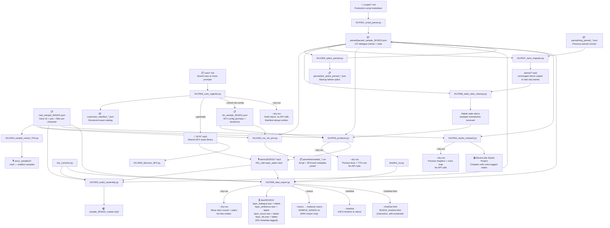
```mermaid
flowchart TD
    S["`📄 scripts/*.md
    Production script markdown`"]
    C["`📋 cast_sample_S01E01.json
    Voice ID + pan + filter per character`"]
    P1["XILP001_script_parser.py"]
    J["`📦 parsed/parsed_sample_S01E01.json
    127 dialogue entries + stats`"]

    CQ["`📋 cues/*.md
    Sound cues & music prompts`"]
    P6["XILP006_cues_ingester.py"]
    SFXCFG["`📋 sfx_sample_S01E01.json
    SFX config (prompts + durations)`"]
    SFXLIB["`🎵 SFX/*.mp3
    Shared SFX asset library`"]
    MNFST6["`📦 cues/cues_manifest_*.json
    Structured asset catalog`"]
    DRY6["`--dry-run
    Audit report, no API calls
    Manifest always written`"]

    P2["XILP002_producer.py"]
    P3["XILP003_audio_assembly.py"]
    DRY["`--dry-run
    Preview lines + TTS cost
    No API calls`"]
    ST["`🎙️ stems/S01E01/*.mp3
    001_cold-open_adam.mp3 …`"]
    OUT["🎧 sample_S01E01_master.mp3"]
    MIX["mix_common.py"]

    S --> P1 --> J
    CQ --> P6
    P6 --> MNFST6
    P6 -->|"--generate"| SFXLIB
    P6 -->|"--enrich-sfx-config"| SFXCFG
    P6 -->|"--dry-run"| DRY6
    SFXCFG --> P2
    SFXLIB --> ST

    XILU004["XILU004_sample_voices_T2S.py"]
    VSAMPLES["`🎙️ voice_samples/<TAG>/<backend>/
    <actor>.mp3 — audition samples`"]
    C --> XILU004
    XILU004 --> VSAMPLES

    XILU005["XILU005_discover_SFX.py"]
    SFXLIB --> XILU005

    XILU006["XILU006_splice_parsed.py"]
    JSPLICE["`📋 parsed/pre_splice_parsed_*.json
    Backup before splice`"]
    J --> XILU006
    XILU006 --> J
    XILU006 --> JSPLICE

    XILU003["XILU003_csv_sfx_join.py"]
    ANNOT["`📋 parsed/annotated_*.csv
    Script + SFX/cast metadata joined`"]
    J --> XILU003
    SFXCFG --> XILU003
    C --> XILU003
    XILU003 --> ANNOT

    P7["XILP007_stem_migrator.py"]
    JORIG["`📦 parsed/orig_parsed_*.json
    Previous parsed version`"]
    MIGR["`stems/<TAG>/*.mp3
    unchanged stems copied to new seq names`"]
    JORIG --> P7
    J --> P7
    P7 --> MIGR

    P8["XILP008_stale_stem_cleanup.py"]
    CLEAN["`Delete stale stems
    seq/type mismatches removed`"]
    MIGR --> P8
    J --> P8
    P8 --> CLEAN
    CLEAN --> P2

    C --> P2
    J --> P2
    P2 -->|"--dry-run"| DRY
    P2 --> ST
    C --> P3
    ST --> P3
    J --> P3
    MIX --> P3
    P3 --> OUT

    P4["XILP004_studio_onboard.py"]
    STUDIO["`🎬 ElevenLabs Studio Project
    Chapters with voice-tagged nodes`"]
    DRY4["`--dry-run
    Preview chapters + voice map
    No API calls`"]

    J --> P4
    C --> P4
    P4 -->|"--dry-run"| DRY4
    P4 --> STUDIO

    P5["XILP005_daw_export.py"]
    VIZ["timeline_viz.py"]
    DAW["`🎚️ daw/S01E01/
    layer_dialogue.wav + labels
    layer_ambience.wav + labels
    layer_music.wav + labels
    layer_sfx.wav + labels
    (ID3 metadata tagged)`"]
    DRY5["`--dry-run
    Show stem counts + paths
    No files written`"]
    MACRO["`--macro → Audacity macro
    SAMPLE_S01E01.txt
    (WAV import only)`"]
    TL5["`--timeline
    ASCII timeline to stdout`"]
    TLHTML5["`--timeline-html
    S01E01_timeline.html
    (interactive, self-contained)`"]

    ST --> P5
    J --> P5
    C --> P5
    MIX --> P5
    VIZ --> P5
    P5 -->|"--dry-run"| DRY5
    P5 --> DAW
    P5 -->|"--macro"| MACRO
    P5 -->|"--timeline"| TL5
    P5 -->|"--timeline-html"| TLHTML5
```

---

## 2. XILP001 — Script Parser Internals

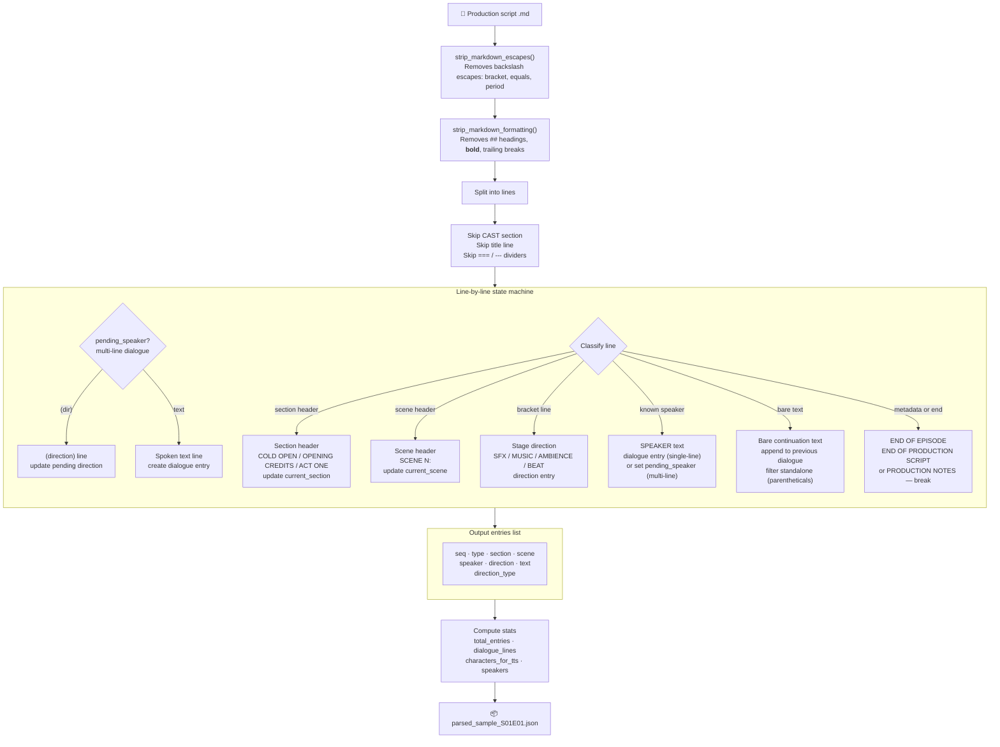
```mermaid
flowchart TD
    IN["📄 Production script .md"]
    ESC["`strip_markdown_escapes()
    Removes backslash escapes: bracket, equals, period`"]
    FMT["`strip_markdown_formatting()
    Removes ## headings, **bold**, trailing breaks`"]
    LINES["Split into lines"]
    SKIP["`Skip CAST section
    Skip title line
    Skip === / --- dividers`"]

    LINES --> SKIP --> LOOP

    subgraph LOOP["Line-by-line state machine"]
        direction TB
        PEND{"`pending_speaker?
        multi-line dialogue`"}
        PDIR["`(direction) line
        update pending direction`"]
        PTXT["`Spoken text line
        create dialogue entry`"]
        CHK{"Classify line"}
        SEC["`Section header
        COLD OPEN / OPENING CREDITS / ACT ONE
        update current_section`"]
        SCN["`Scene header
        SCENE N:
        update current_scene`"]
        DIR["`Stage direction
        SFX / MUSIC / AMBIENCE / BEAT
        direction entry`"]
        DLG["`SPEAKER text
        dialogue entry (single-line)
        or set pending_speaker (multi-line)`"]
        CONT["`Bare continuation text
        append to previous dialogue
        filter standalone (parentheticals)`"]
        STOP["`END OF EPISODE
        END OF PRODUCTION SCRIPT
        or PRODUCTION NOTES — break`"]

        PEND -->|"(dir)"| PDIR
        PEND -->|text| PTXT
        CHK -->|section header| SEC
        CHK -->|scene header| SCN
        CHK -->|bracket line| DIR
        CHK -->|known speaker| DLG
        CHK -->|bare text| CONT
        CHK -->|metadata or end| STOP
    end

    IN --> ESC --> FMT --> LINES
    LOOP --> ENTRIES

    subgraph ENTRIES["Output entries list"]
        direction LR
        E1["`seq · type · section · scene
        speaker · direction · text
        direction_type`"]
    end

    ENTRIES --> STATS["`Compute stats
    total_entries · dialogue_lines
    characters_for_tts · speakers`"]
    STATS --> JSON["📦 parsed_sample_S01E01.json"]
```

### Speaker normalization

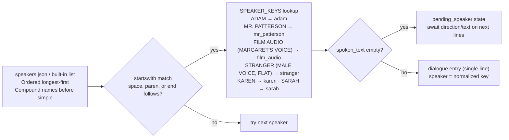
```mermaid
flowchart LR
    RAW["`speakers.json / built-in list
    Ordered longest-first
    Compound names before simple`"]
    RAW --> MATCH{"`startswith match
    space, paren, or end follows?`"}
    MATCH -->|yes| KEY["`SPEAKER_KEYS lookup
    ADAM → adam
    MR. PATTERSON → mr_patterson
    FILM AUDIO (MARGARET'S VOICE) → film_audio
    STRANGER (MALE VOICE, FLAT) → stranger
    KAREN → karen · SARAH → sarah`"]
    MATCH -->|no| SKIP2["try next speaker"]
    KEY --> MODE{"`spoken_text empty?`"}
    MODE -->|yes| PEND["`pending_speaker state
    await direction/text on next lines`"]
    MODE -->|no| ENTRY["`dialogue entry (single-line)
    speaker = normalized key`"]
```

---

## 3. XILP002 — Voice Generation

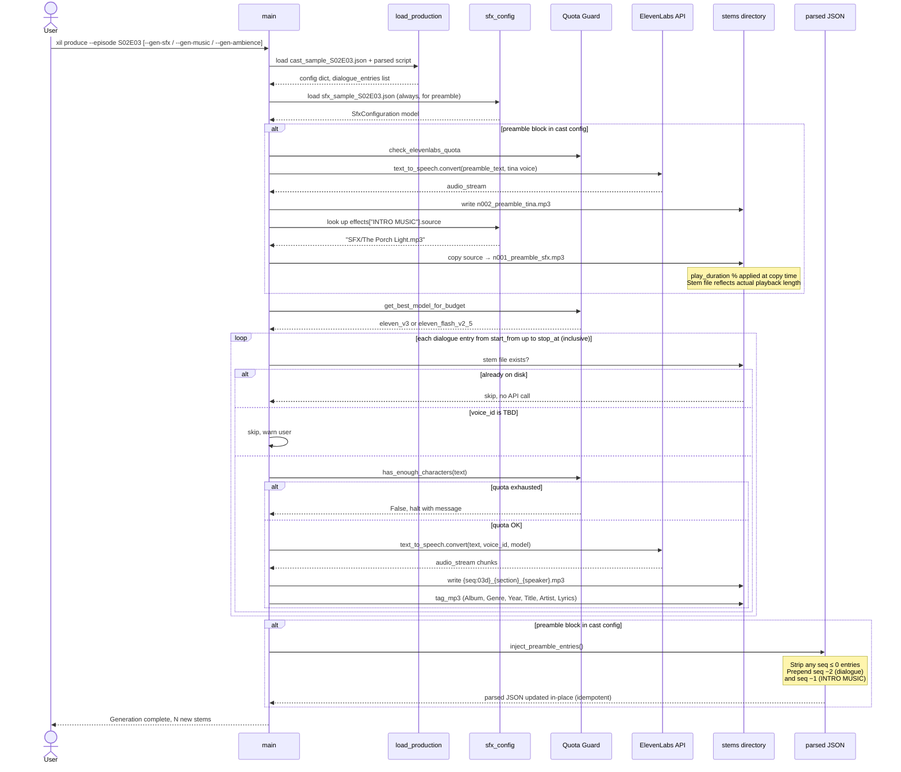
```mermaid
sequenceDiagram
    actor User
    participant M as main
    participant LP as load_production
    participant SFX as sfx_config
    participant QG as Quota Guard
    participant API as ElevenLabs API
    participant FS as stems directory
    participant PJ as parsed JSON

    User->>M: xil produce --episode S02E03 [--gen-sfx / --gen-music / --gen-ambience]
    M->>LP: load cast_sample_S02E03.json + parsed script
    LP-->>M: config dict, dialogue_entries list
    M->>SFX: load sfx_sample_S02E03.json (always, for preamble)
    SFX-->>M: SfxConfiguration model

    alt preamble block in cast config
        M->>QG: check_elevenlabs_quota
        M->>API: text_to_speech.convert(preamble_text, tina voice)
        API-->>M: audio_stream
        M->>FS: write n002_preamble_tina.mp3
        M->>SFX: look up effects["INTRO MUSIC"].source
        SFX-->>M: "SFX/The Porch Light.mp3"
        M->>FS: copy source → n001_preamble_sfx.mp3
        note over FS: play_duration % applied at copy time<br>Stem file reflects actual playback length
    end

    M->>QG: get_best_model_for_budget
    QG-->>M: eleven_v3 or eleven_flash_v2_5

    loop each dialogue entry from start_from up to stop_at (inclusive)
        M->>FS: stem file exists?
        alt already on disk
            FS-->>M: skip, no API call
        else voice_id is TBD
            M->>M: skip, warn user
        else
            M->>QG: has_enough_characters(text)
            alt quota exhausted
                QG-->>M: False, halt with message
            else quota OK
                M->>API: text_to_speech.convert(text, voice_id, model)
                API-->>M: audio_stream chunks
                M->>FS: write {seq:03d}_{section}_{speaker}.mp3
                M->>FS: tag_mp3 (Album, Genre, Year, Title, Artist, Lyrics)
            end
        end
    end

    alt preamble block in cast config
        M->>PJ: inject_preamble_entries()
        note over PJ: Strip any seq ≤ 0 entries<br>Prepend seq −2 (dialogue)<br>and seq −1 (INTRO MUSIC)
        PJ-->>M: parsed JSON updated in-place (idempotent)
    end

    M-->>User: Generation complete, N new stems
```

> **Range control:** `--start-from N` resumes an interrupted run by skipping entries with seq < N.
> `--stop-at N` halts after seq N (inclusive). Combine them (`--start-from 50 --stop-at 80`) to
> regenerate a specific scene without touching the rest of the episode.

> **Draft mode:** `--backend gtts` routes all dialogue voice stems through Google Translate TTS
> at no cost — all characters use the same flat voice, useful for checking episode duration before
> spending ElevenLabs credits. No API key required. eleven_v3 inline tags are stripped automatically.
> SFX/music/ambience generation is unaffected. Requires: `pip install xil-pipeline[tts-alt]`

---

## 4. XILP003 — Audio Assembly (Two-Pass Multi-Track Mix)

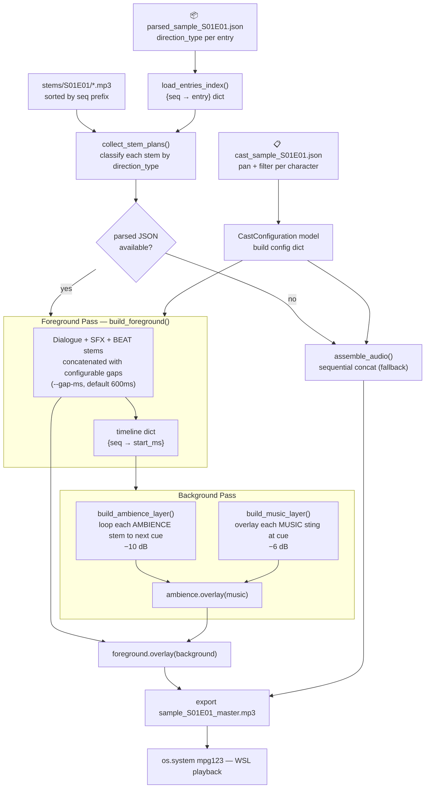
```mermaid
flowchart TD
    C2["`📋 cast_sample_S01E01.json
    pan + filter per character`"]
    J2["`📦 parsed_sample_S01E01.json
    direction_type per entry`"]
    ST2["`stems/S01E01/*.mp3
    sorted by seq prefix`"]

    C2 --> CFG_LOAD["`CastConfiguration model
    build config dict`"]
    J2 --> IDX["`load_entries_index()
    {seq → entry} dict`"]
    ST2 --> PLANS["`collect_stem_plans()
    classify each stem by direction_type`"]
    IDX --> PLANS

    PLANS --> BRANCH{"parsed JSON\navailable?"}

    BRANCH -->|no| SEQ["`assemble_audio()
    sequential concat (fallback)`"]

    BRANCH -->|yes| FG

    subgraph FG["Foreground Pass — build_foreground()"]
        direction TB
        FG1["`Dialogue + SFX + BEAT stems
        concatenated with configurable gaps
        (--gap-ms, default 600ms)`"]
        FG2["`timeline dict
        {seq → start_ms}`"]
        FG1 --> FG2
    end

    subgraph BG["Background Pass"]
        direction TB
        AMB["`build_ambience_layer()
        loop each AMBIENCE stem to next cue
        −10 dB`"]
        MUS["`build_music_layer()
        overlay each MUSIC sting at cue
        −6 dB`"]
        AMB --> BGMIX["ambience.overlay(music)"]
        MUS --> BGMIX
    end

    FG2 --> BG
    FG1 --> OVERLAY["foreground.overlay(background)"]
    BGMIX --> OVERLAY

    OVERLAY --> EXPORT2["export sample_S01E01_master.mp3"]
    SEQ --> EXPORT2
    EXPORT2 --> PLAY2["os.system mpg123 — WSL playback"]

    CFG_LOAD --> FG
    CFG_LOAD --> SEQ
```

> **Vintage filter (scene-scoped):** Add `"vintage_scenes": ["scene-3", "scene-4"]` to the
> SFX config to apply a 1960s-era audio filter (HF roll-off + −1 dB) to all dialogue in
> those scenes. The scene label must match the `scene` field in the parsed JSON.
> Tape hiss or other ambient texture for the flashback is handled separately as a looped
> AMBIENCE entry — no code change needed.

> **Restartability:** XILP003 has no ElevenLabs dependency. Re-running assembly after adjusting
> effects or adding missing stems requires no API key and carries no TTS quota risk.

> **Runtime control:** `--gap-ms N` sets the silence between foreground stems (default 600ms).
> With 294 stems in S02E03, reducing to 300ms saves ~1.5 min; to 200ms saves ~2 min.

---

## 5. XILP004 — Studio Project Onboarding

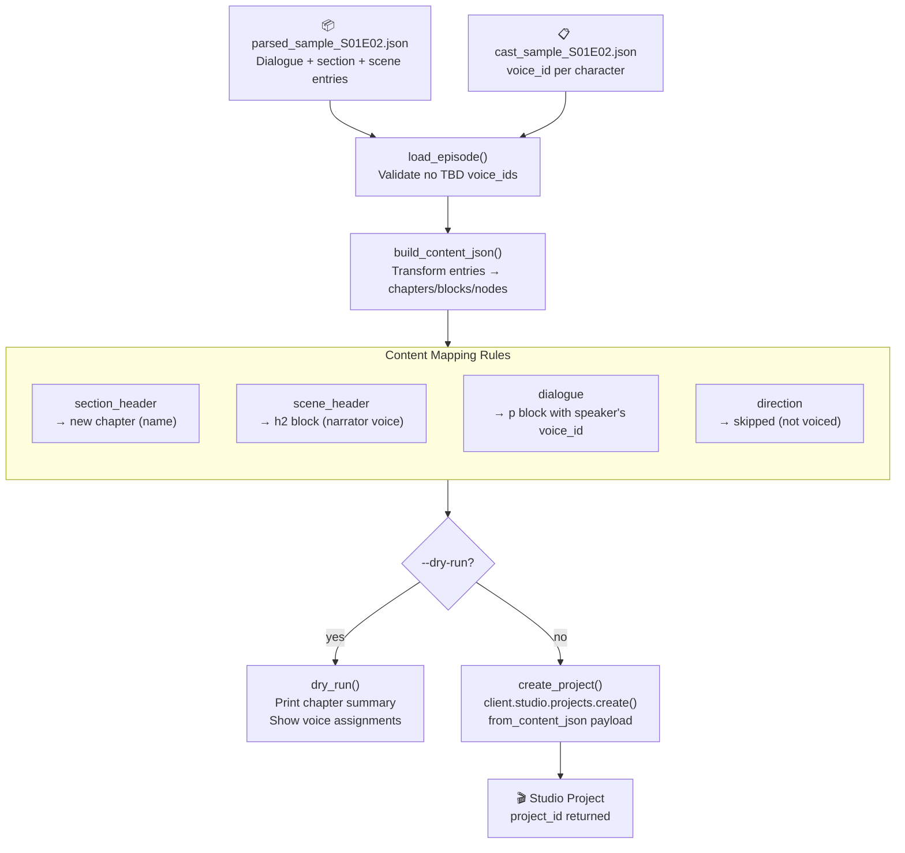
```mermaid
flowchart TD
    PARSED["`📦 parsed_sample_S01E02.json
    Dialogue + section + scene entries`"]
    CAST["`📋 cast_sample_S01E02.json
    voice_id per character`"]

    LOAD["`load_episode()
    Validate no TBD voice_ids`"]
    BUILD["`build_content_json()
    Transform entries → chapters/blocks/nodes`"]

    PARSED --> LOAD
    CAST --> LOAD
    LOAD --> BUILD

    subgraph MAPPING["Content Mapping Rules"]
        direction TB
        SEC["`section_header
        → new chapter (name)`"]
        SCN["`scene_header
        → h2 block (narrator voice)`"]
        DLG["`dialogue
        → p block with speaker's voice_id`"]
        DIR["`direction
        → skipped (not voiced)`"]
    end

    BUILD --> MAPPING
    MAPPING --> MODE{"--dry-run?"}
    MODE -->|yes| DRY["`dry_run()
    Print chapter summary
    Show voice assignments`"]
    MODE -->|no| API["`create_project()
    client.studio.projects.create()
    from_content_json payload`"]
    API --> PROJ["`🎬 Studio Project
    project_id returned`"]
```

> **Speaker-name problem solved:** Each `tts_node` carries its own `voice_id` — speaker names
> never appear in the text, so TTS won't voice them. No manual post-creation cleanup needed.

---

## 6. Stem File Naming Convention

### Standard stems (seq ≥ 1)

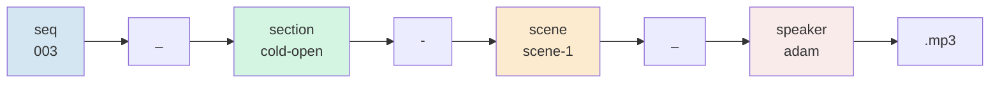
```mermaid
flowchart LR
    SEQ["`seq
    003`"]
    SEP1["_"]
    SEC["`section
    cold-open`"]
    SEP2["-"]
    SCN["`scene
    scene-1`"]
    SEP3["_"]
    SPK["`speaker
    adam`"]
    EXT[".mp3"]

    SEQ --> SEP1 --> SEC --> SEP2 --> SCN --> SEP3 --> SPK --> EXT

    style SEQ fill:#d4e6f1
    style SEC fill:#d5f5e3
    style SCN fill:#fdebd0
    style SPK fill:#f9ebea
```

**Example:** `003_cold-open_adam.mp3`, `028_act1-scene-1_rian.mp3`, `102_act2-scene-5_mr_patterson.mp3`

### Preamble stems (seq < 0)

Preamble stems use an **`n` prefix** in place of the zero-padded integer, where  stands for "negative":

| Seq | Filename | Layer |
|-----|----------|-------|
| −2 | `n002_preamble_tina.mp3` | Dialogue (broadcast intro voice) |
| −1 | `n001_preamble_sfx.mp3` | Music (intro music, foreground sequential) |

 in  parses the  prefix and returns the corresponding negative integer.
Negative seqs sort before all script seqs (≥ 1) so preamble always plays first.

Preamble entries at seq −2 and −1 are injected into  by XILP002 after stem generation,
making the parsed JSON a complete record of the full episode including the broadcast intro.

---

## 7. API Cost Guard Flow

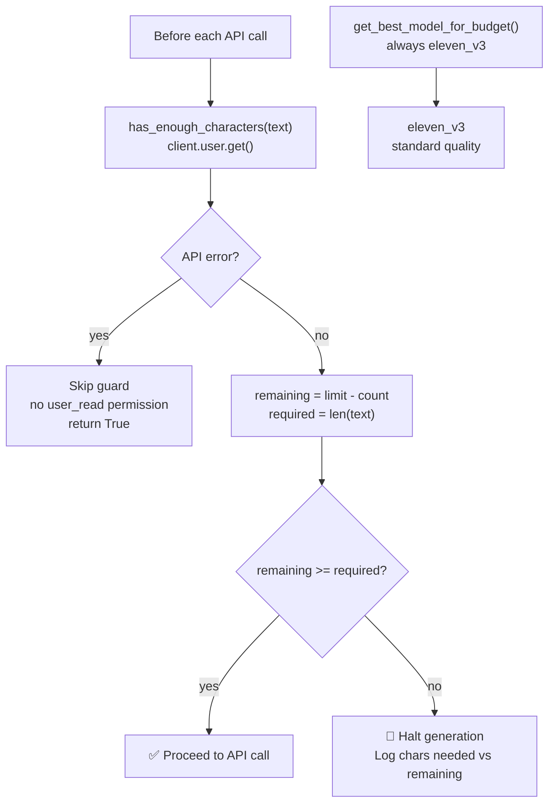
```mermaid
flowchart TD
    START["Before each API call"]
    CHK["`has_enough_characters(text)
    client.user.get()`"]
    ERR{"API error?"}
    SKIP_GUARD["`Skip guard
    no user_read permission
    return True`"]
    CALC["`remaining = limit - count
    required = len(text)`"]
    CMP{"remaining >= required?"}
    OK["✅ Proceed to API call"]
    HALT["`🛑 Halt generation
    Log chars needed vs remaining`"]

    START --> CHK --> ERR
    ERR -->|yes| SKIP_GUARD
    ERR -->|no| CALC --> CMP
    CMP -->|yes| OK
    CMP -->|no| HALT

    BUDGET["`get_best_model_for_budget()
    always eleven_v3`"]
    V3["`eleven_v3
    standard quality`"]

    BUDGET --> V3
```

---

## 8. XILP005 — DAW Layer Export

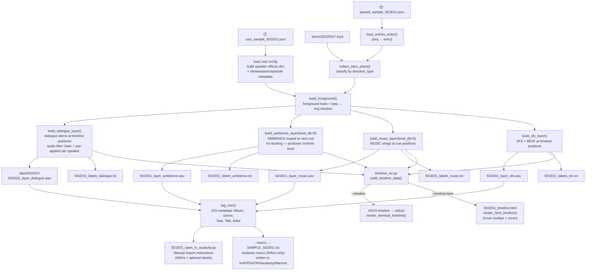
```mermaid
flowchart TD
    C5["`📋 cast_sample_S01E01.json`"]
    J5["`📦 parsed_sample_S01E01.json`"]
    ST5["`stems/S01E01/*.mp3`"]

    C5 --> L5["`load cast config
    build speaker effects dict
    + show/season/episode metadata`"]
    J5 --> IDX5["`load_entries_index()
    {seq → entry}`"]
    ST5 --> PLANS5["`collect_stem_plans()
    classify by direction_type`"]
    IDX5 --> PLANS5

    PLANS5 --> TL5

    TL5["`build_foreground()
    foreground track + {seq → ms} timeline`"]
    L5 --> TL5

    TL5 --> DLG5["`build_dialogue_layer()
    dialogue stems at timeline positions
    audio filter chain + pan applied per speaker`"]
    TL5 --> AMB5["`build_ambience_layer(level_db=0)
    AMBIENCE looped to next cue
    no ducking — producer controls level`"]
    TL5 --> MUS5["`build_music_layer(level_db=0)
    MUSIC stings at cue positions`"]
    TL5 --> SFX5["`build_sfx_layer()
    SFX + BEAT at timeline positions`"]

    DLG5 --> WAV1["`daw/S01E01/
    S01E01_layer_dialogue.wav`"]
    AMB5 --> WAV2["S01E01_layer_ambience.wav"]
    MUS5 --> WAV3["S01E01_layer_music.wav"]
    SFX5 --> WAV4["S01E01_layer_sfx.wav"]

    WAV1 --> TAG5["`tag_wav()
    ID3 metadata: Album, Genre,
    Year, Title, Artist`"]
    WAV2 --> TAG5
    WAV3 --> TAG5
    WAV4 --> TAG5

    DLG5 --> LBL1["S01E01_labels_dialogue.txt"]
    AMB5 --> LBL2["S01E01_labels_ambience.txt"]
    MUS5 --> LBL3["S01E01_labels_music.txt"]
    SFX5 --> LBL4["S01E01_labels_sfx.txt"]

    TAG5 --> SCRIPT5["`S01E01_open_in_audacity.py
    Manual import instructions
    (WAVs + optional labels)`"]
    TAG5 --> MACRO5["`--macro → SAMPLE_S01E01.txt
    Audacity macro (WAVs only)
    written to %APPDATA%/audacity/Macros/`"]

    DLG5 --> TLVIZ["`timeline_viz.py
    build_timeline_data()`"]
    AMB5 --> TLVIZ
    MUS5 --> TLVIZ
    SFX5 --> TLVIZ
    TLVIZ -->|"--timeline"| ASCII5["`ASCII timeline → stdout
    render_terminal_timeline()`"]
    TLVIZ -->|"--timeline-html"| HTML5["`S01E01_timeline.html
    render_html_timeline()
    (hover tooltips + zoom)`"]
```

> **Audacity alignment:** All four WAV files are exactly the same duration (full episode length).
> Importing them into Audacity at t=0 produces four perfectly aligned tracks — no repositioning
> or time-offset metadata required.

> **Audio metadata:** Each WAV layer is tagged with ID3 metadata (Album = show name, Genre = "Podcast",
> Year, Title = e.g. "S02E03 Dialogue", Artist = season title) via `tag_wav()` from `sfx_common.py`.

> **Label tracks:** Audacity-format label files (tab-separated start/end/text) are generated alongside
> each WAV layer. Import labels separately via `File > Import > Labels...` in Audacity.

> **Audacity macro:** `--macro` writes a one-click macro (`<SLUG>_<TAG>.txt`) to the Audacity Macros
> directory. The macro imports the four WAV files only (labels are imported manually). Access via
> `Tools > Macros` in Audacity.

> **Preamble support:** When the cast config includes a `preamble` block, XILP002 generates
> `n002_preamble_tina.mp3` (broadcast intro voice, seq −2) and copies the intro music from
> `sfx_config.effects["INTRO MUSIC"].source` into `n001_preamble_sfx.mp3` (seq −1).  It then
> injects seq −2/−1 entries into the parsed JSON so they flow through the standard
> `collect_stem_plans()` path in XILP003 and XILP005 — no special preamble parameter needed.
> Preamble music has `foreground_override = True` so it plays sequentially, not as a background
> overlay.

> **Timeline visualization:** `--timeline` prints an ASCII multitrack view to stdout; `--timeline-html`
> writes a self-contained HTML file with color-coded swim lanes, hover tooltips, and Ctrl+scroll zoom.
> Both work with `--dry-run` — the dry-run path uses `build_foreground_timeline_only()` (mutagen
> header reads, no audio decoding) and the `compute_*_labels()` helpers in `mix_common.py`.

> **Note on mod-script-pipe:** The generated helper script includes pipe automation code, but
> Audacity 3.7.x does not reliably initialise mod-script-pipe on Windows. The Audacity macro
> (`--macro`) is the recommended automation path.

> **Auto-save:** Add `--save-aup3` to append a `SaveProject2` command at the end of
> `{TAG}_open_in_audacity.py`.  This requires mod-script-pipe to be active and will save the
> project as an `.aup3` file immediately after import.  Only useful when pipe automation is
> confirmed working; otherwise omit this flag and save manually.

---

## 9. XILP006 — Cues Sheet Ingester

Pre-processing step that bridges a human-authored sound cues & music prompts document into the
automated pipeline.  Sits **after XILP001** and **before XILU002 / XILP002** — enriching the SFX
config and populating the shared asset library before stem generation begins.

### 9a. Overall flow

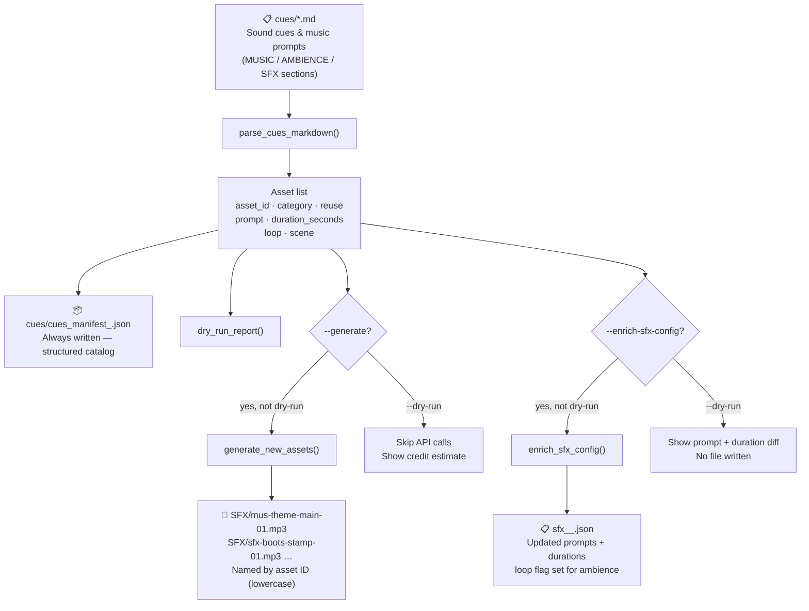
```mermaid
flowchart TD
    CQ["`📋 cues/*.md
    Sound cues & music prompts
    (MUSIC / AMBIENCE / SFX sections)`"]
    PARSE["parse_cues_markdown()"]
    ASSETS["`Asset list
    asset_id · category · reuse
    prompt · duration_seconds
    loop · scene`"]
    MANIFEST["`📦 cues/cues_manifest_<TAG>.json
    Always written — structured catalog`"]
    AUDIT["dry_run_report()"]

    CQ --> PARSE --> ASSETS
    ASSETS --> MANIFEST
    ASSETS --> AUDIT

    ASSETS --> GEN_BRANCH{"--generate?"}
    GEN_BRANCH -->|"yes, not dry-run"| GEN["generate_new_assets()"]
    GEN_BRANCH -->|"--dry-run"| SKIP_GEN["`Skip API calls
    Show credit estimate`"]
    GEN --> SFXLIB["`🎵 SFX/mus-theme-main-01.mp3
    SFX/sfx-boots-stamp-01.mp3 …
    Named by asset ID (lowercase)`"]

    ASSETS --> ENR_BRANCH{"--enrich-sfx-config?"}
    ENR_BRANCH -->|"yes, not dry-run"| ENR["enrich_sfx_config()"]
    ENR_BRANCH -->|"--dry-run"| DIFF["`Show prompt + duration diff
    No file written`"]
    ENR --> SFXCFG["`📋 sfx_<slug>_<TAG>.json
    Updated prompts + durations
    loop flag set for ambience`"]
```

### 9b. Cues markdown parsing

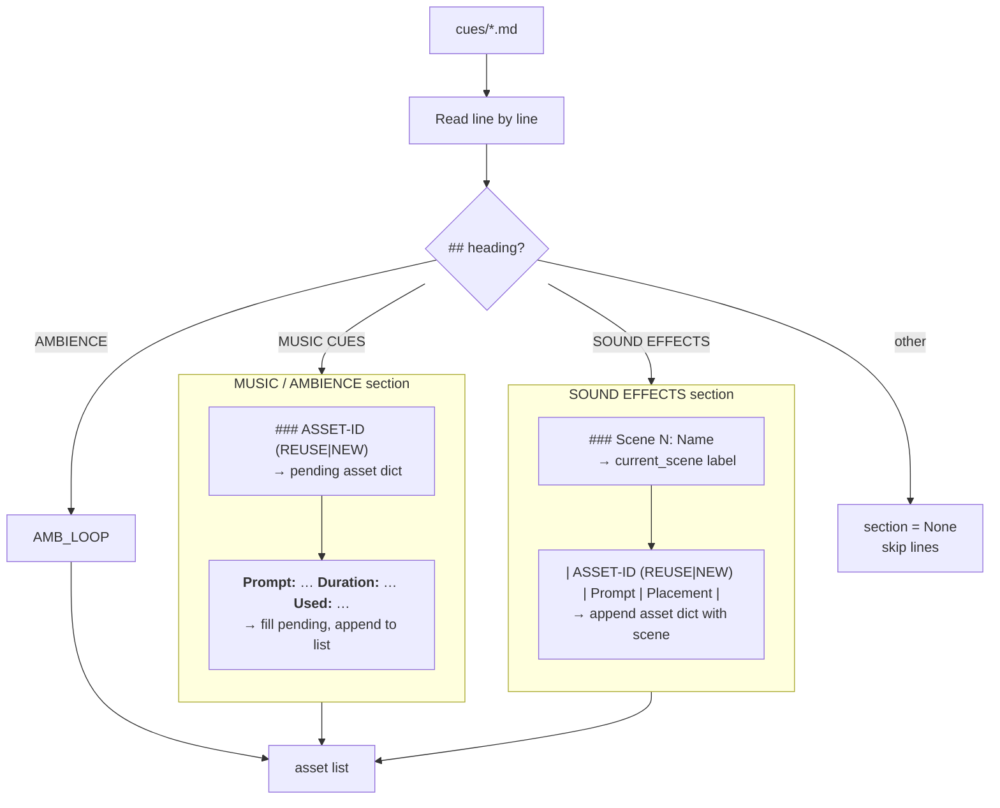
```mermaid
flowchart TD
    MD["cues/*.md"]
    SEC{"`## heading?`"}

    MD --> LINES["Read line by line"]
    LINES --> SEC

    SEC -->|"MUSIC CUES"| MUSIC_LOOP
    SEC -->|"AMBIENCE"| AMB_LOOP
    SEC -->|"SOUND EFFECTS"| SFX_LOOP
    SEC -->|"other"| NULL["section = None\nskip lines"]

    subgraph MUSIC_LOOP["MUSIC / AMBIENCE section"]
        direction TB
        H3["`### ASSET-ID (REUSE|NEW)
        → pending asset dict`"]
        PLINE["`**Prompt:** … **Duration:** … **Used:** …
        → fill pending, append to list`"]
        H3 --> PLINE
    end

    subgraph SFX_LOOP["SOUND EFFECTS section"]
        direction TB
        SCENE_H["`### Scene N: Name
        → current_scene label`"]
        ROW["`| ASSET-ID (REUSE|NEW) | Prompt | Placement |
        → append asset dict with scene`"]
        SCENE_H --> ROW
    end

    MUSIC_LOOP --> OUT2["asset list"]
    AMB_LOOP --> OUT2
    SFX_LOOP --> OUT2
```

### 9c. Library audit status codes

| Status | Meaning |
|--------|---------|
| `EXISTS` | `SFX/<asset-id>.mp3` is present and non-empty |
| `REUSE` | Asset is marked *(REUSE)* in the cues sheet but not yet in `SFX/` — must be sourced or regenerated |
| `NEW` | Asset is marked *(NEW)* — needs ElevenLabs API generation via `--generate` |

### 9d. SFX config enrichment matching

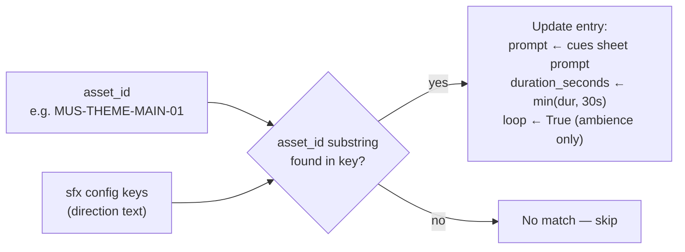
```mermaid
flowchart LR
    AID["`asset_id
    e.g. MUS-THEME-MAIN-01`"]
    KEYS["`sfx config keys
    (direction text)`"]
    MATCH{"`asset_id substring
    found in key?`"}
    UPDATE["`Update entry:
    prompt ← cues sheet prompt
    duration_seconds ← min(dur, 30s)
    loop ← True (ambience only)`"]
    SKIP["No match — skip"]

    AID --> MATCH
    KEYS --> MATCH
    MATCH -->|yes| UPDATE
    MATCH -->|no| SKIP
```

> **Duration cap:** ElevenLabs Sound Effects API accepts at most 30 seconds per call.
> Assets with longer cues-sheet durations (e.g. 3-minute underscore) are generated at 30s
> and flagged `[CAPPED]` in the audit report.  Looping in XILP003/XILP005 handles extension.

### 9e. Recommended run order for a new episode

```bash
# 1. Parse script and generate skeleton configs
xil scan "scripts/<script>.md"          # pre-flight: catch unknown speakers
xil parse "scripts/<script>.md" --episode S02E03

# 1b. (Optional) Review full episode structure before any API spend
xil csv-join --episode S02E03                 # annotated CSV: SFX + cast columns

# 2. Ingest cues sheet — enrich sfx config + audit (no API calls yet)
xil cues --episode S02E03 \
    --cues "cues/<cues-file>.md" --enrich-sfx-config

# 3. Preview what needs generating
xil cues --episode S02E03 \
    --cues "cues/<cues-file>.md" --generate --dry-run

# 4. Generate new SFX/music assets into SFX/ library
xil cues --episode S02E03 \
    --cues "cues/<cues-file>.md" --generate

# 5. Generate voice stems (sfx config already enriched)
#    Preamble: ensure sfx_<slug>_S02E03.json contains an "INTRO MUSIC" entry with a "source" path
#    XILP002 will copy that file → n001_preamble_sfx.mp3 and inject seq -2/-1 into parsed JSON
xil produce --episode S02E03 --dry-run
xil produce --episode S02E03
# Generate SFX/music/ambience stems by category (omit flags to generate all):
xil sfx --episode S02E03 --gen-sfx --dry-run
xil sfx --episode S02E03 --gen-music --dry-run
xil sfx --episode S02E03 --gen-ambience --dry-run
xil sfx --episode S02E03

# 6. Assemble master MP3 or export DAW layers
xil assemble --episode S02E03
xil daw --episode S02E03 --macro

# 7. Inspect asset placement (no audio decode needed with --dry-run)
xil daw --episode S02E03 --dry-run --timeline
xil daw --episode S02E03 --timeline --timeline-html
```

### 9f. Punch-in run order (script revised after full generation)

```bash
# 1. Re-parse the revised script (preserves orig_ as the old reference)
xil parse "scripts/<revised>.md" --episode S02E03

# 2. Migrate unchanged stems to new seq-numbered filenames
xil migrate --episode S02E03 --dry-run   # preview first
xil migrate --episode S02E03

# 2b. Clean up stale stems left behind by migration
xil cleanup --episode S02E03 --dry-run  # preview first
xil cleanup --episode S02E03

# 3. Generate only the gaps (XILP002 skips files already on disk)
xil produce --episode S02E03 --dry-run
xil produce --episode S02E03

# 4. Reassemble
xil assemble --episode S02E03
xil daw --episode S02E03 --macro
```

---

## 10. Timeline Visualization (`timeline_viz.py`)

Shared module that renders asset placement across all four layers without any pydub dependency.
Consumed by XILP005 via `--timeline` and `--timeline-html`.

### 10a. Data model

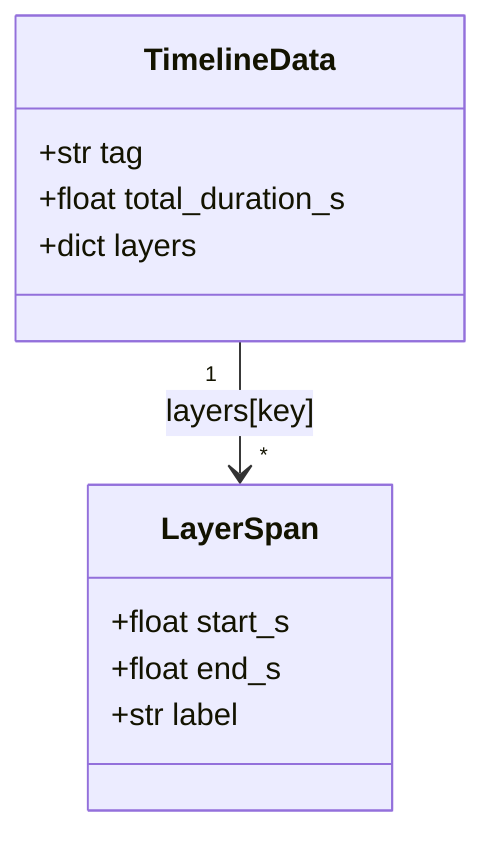
```mermaid
classDiagram
    class LayerSpan {
        +float start_s
        +float end_s
        +str label
    }
    class TimelineData {
        +str tag
        +float total_duration_s
        +dict layers
    }
    TimelineData "1" --> "*" LayerSpan : layers[key]
```

### 10b. Rendering paths

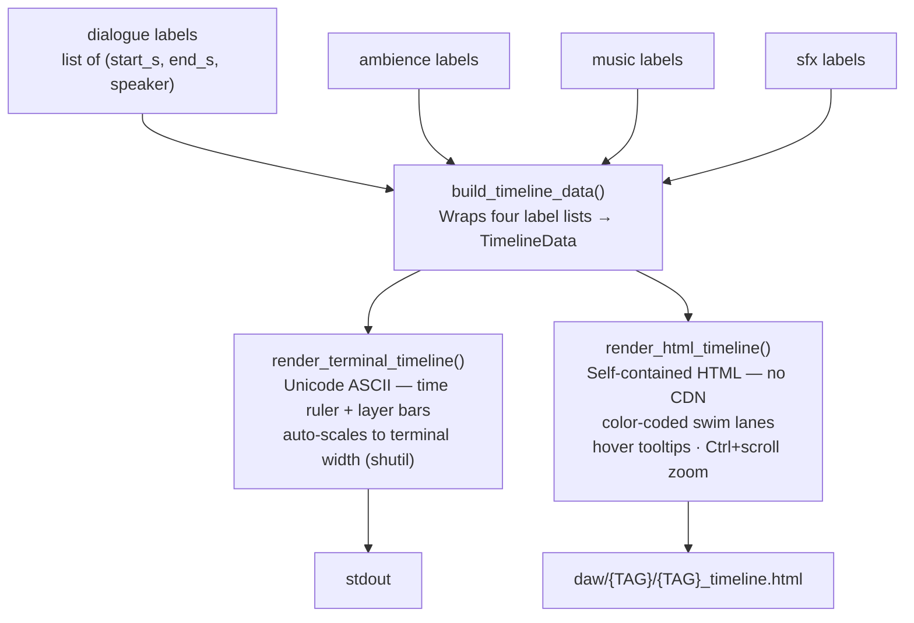
```mermaid
flowchart TD
    DLG_L["`dialogue labels
    list of (start_s, end_s, speaker)`"]
    AMB_L["`ambience labels`"]
    MUS_L["`music labels`"]
    SFX_L["`sfx labels`"]

    BUILD["`build_timeline_data()
    Wraps four label lists → TimelineData`"]

    DLG_L --> BUILD
    AMB_L --> BUILD
    MUS_L --> BUILD
    SFX_L --> BUILD

    BUILD --> TERM["`render_terminal_timeline()
    Unicode ASCII — time ruler + layer bars
    auto-scales to terminal width (shutil)`"]
    BUILD --> HTML["`render_html_timeline()
    Self-contained HTML — no CDN
    color-coded swim lanes
    hover tooltips · Ctrl+scroll zoom`"]

    TERM --> STDOUT["stdout"]
    HTML --> FILE["`daw/{TAG}/{TAG}_timeline.html`"]
```

### 10c. Dry-run label path (no audio decoding)

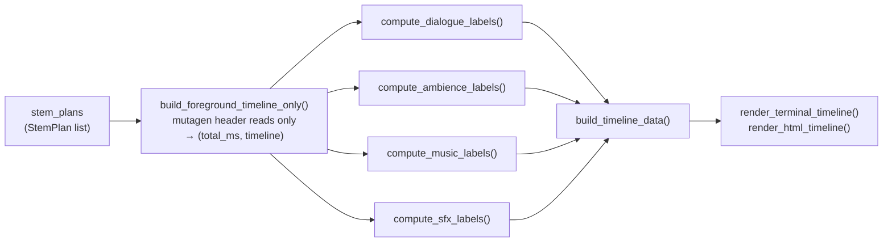
```mermaid
flowchart LR
    PLANS["`stem_plans
    (StemPlan list)`"]
    FT["`build_foreground_timeline_only()
    mutagen header reads only
    → (total_ms, timeline)`"]
    PLANS --> FT

    FT --> DLG2["`compute_dialogue_labels()`"]
    FT --> AMB2["`compute_ambience_labels()`"]
    FT --> MUS2["`compute_music_labels()`"]
    FT --> SFX2["`compute_sfx_labels()`"]

    DLG2 --> BTD["`build_timeline_data()`"]
    AMB2 --> BTD
    MUS2 --> BTD
    SFX2 --> BTD

    BTD --> RENDER["`render_terminal_timeline()
    render_html_timeline()`"]
```

> **Fast dry-run:** `build_foreground_timeline_only()` uses `mutagen.mp3.MP3(path).info.length`
> for header-only duration reads — orders of magnitude faster than `AudioSegment.from_file()`
> for a full episode.  The `compute_*_labels()` helpers apply the same boundary logic as the
> audio-loading layer builders (`build_ambience_layer` etc.) but return label tuples only.

---

## 11. Ambience Stop Markers

Script-side directives that end an ambience loop without starting a new one.

### Recognized patterns
- `[AMBIENCE: STOP]` — explicit stop
- `[AMBIENCE: DINER FADES OUT]`, `[AMBIENCE: B&B FADES OUT]` — any `FADES OUT` suffix

### How they work
1. **XILP001** auto-generates `type: "silence", duration_seconds: 0.0` entries in the sfx config — no audio asset is created
2. **mix_common `collect_stem_plans()`** injects a synthetic `StemPlan(filepath="")` for each stop marker found in the entries index — they never have a stem file on disk
3. **`build_ambience_layer()`** uses stop markers as `bg_cues` boundary markers: the preceding ambience loop's `end_ms` is set to the stop marker's timeline position
4. Stop marker plans are skipped when loading audio (empty filepath) and generate no label in the timeline

### `loop: false` vs stop markers
| | `loop: false` | Stop marker |
|---|---|---|
| Controlled in | sfx config | script |
| Effect | Plays file once (no tiling) | Ends loop at cue position |
| Audio generated | Yes | No |
| Timeline label | Yes | No |

## 12. XILP007 — Stem Migrator (Punch-In Workflow)

Migrates existing stems when a parsed script is revised. Compares old and
new parsed JSONs, copies unchanged stems to their new seq-numbered filenames,
and produces a report of what still needs TTS/SFX generation.  Run XILP002
afterwards — it skips stems already on disk, so only the gaps get API calls.

### When to use

- Script text corrections after a full TTS run
- Character renames / speaker reassignments
- Lines deleted or added (seq numbers shift for the remaining entries)
- Episode trimming (cutting scenes to meet runtime)

### Workflow

```
# 1. Edit & re-parse the revised script
xil parse "scripts/<revised>.md" --episode S02E03

# 2. Preview the migration plan (no file changes)
xil migrate --episode S02E03 --dry-run

# 3. Copy unchanged stems into new seq-numbered filenames
xil migrate --episode S02E03

# 4. Generate only the missing/changed/new stems
xil produce --episode S02E03 --dry-run
xil produce --episode S02E03
```

### Matching modes

| Mode | Flag | Em-dash / ellipsis variants | Use when |
|---|---|---|---|
| Fuzzy (default) | *(omit)* | Treated as identical | Punctuation-only edits |
| Strict | `--strict` | Must match exactly | Verify every character |

### Status codes

| Code | Meaning | Action needed |
|---|---|---|
| `COPY` | Text + speaker unchanged | File copied to new seq name; no TTS |
| `SPEAKER` | Same text, different speaker | Regen — different voice |
| `NEW` | No matching old entry | Generate fresh |
| `MISSING` | Match found, old file absent | Generate fresh |
| `SKIP` | Section/scene header — no stem | None |

### Two-phase match algorithm

1. **Exact**: `(normalized_text, speaker)` — safe COPY or MISSING
2. **Text-only fallback** (dialogue only): text matches but speaker differs → `SPEAKER`

The two-phase approach lets the tool distinguish "punctuation edit on same speaker"
(COPY in fuzzy mode) from "line reassigned to a different character" (SPEAKER).

## 13. XILU003 — CSV Annotation Utility

Read-only utility that joins a parsed episode CSV with the SFX JSON and cast JSON, producing a
single annotated review spreadsheet.  Useful for verifying that all direction entries have SFX
config entries, all speakers are assigned voices, and reviewing the full episode structure before
committing to a TTS run.

```bash
xil csv-join --episode S02E03
xil csv-join --episode S02E03 --output review/S02E03_annotated.csv
```

### Inputs / outputs

| File | Default path | Override flag |
|---|---|---|
| Input CSV | `parsed/parsed_<slug>_{TAG}.csv` | `--csv` |
| SFX config | `sfx_<slug>_{TAG}.json` | `--sfx` |
| Cast config | `cast_<slug>_{TAG}.json` | `--cast` |
| Output CSV | `parsed/annotated_<slug>_{TAG}.csv` | `--output` |

### Output columns appended

The output CSV keeps all original parsed columns (`seq`, `type`, `section`, `scene`, `speaker`,
`direction`, `text`, `direction_type`) and appends:

| Column | Source | Notes |
|---|---|---|
| `sfx_prompt` | SFX config `prompt` | Empty for dialogue |
| `sfx_duration` | SFX config `duration_seconds` | Empty for dialogue / silence |
| `sfx_type` | SFX config `type` | `sfx` / `silence` / `source` |
| `cast_full_name` | Cast config `full_name` | Empty for non-dialogue |
| `cast_voice_id` | Cast config `voice_id` | `TBD` if not yet assigned |
| `cast_role` | Cast config `role` | Empty if unset |

No API key required — read-only join, no audio generated.

## 14. XILP008 — Stale Stem Cleanup

Removes stale stems left behind after a parsed script revision and stem migration.
After XILP007 copies unchanged stems to new seq-numbered filenames, old stems whose
seq numbers now map to a different entry type remain on disk and cause warnings in
XILP005.  This script finds and deletes them.

### When to use

- After running XILP007 (stem migrator) and before XILP002 (voice generation)
- When XILP005 reports `[W] Stale stem skipped` warnings

### Stale detection rules

| Condition | Reason |
|---|---|
| Parsed entry is a header (`section_header` / `scene_header`) | Header entries never have stems — any stem at that seq is stale |
| Filename ends with `_sfx` but parsed entry at that seq is `dialogue` | Type mismatch — old SFX stem, now a spoken line |
| Filename ends with a speaker name but parsed entry is `direction` | Type mismatch — old dialogue stem, now a stage direction |
| Dialogue stem whose speaker suffix doesn't match the parsed speaker | Speaker mismatch — line reassigned to a different character |
| Multiple stems share the same seq number | Duplicate — only the one matching the expected basename survives |
| Seq number not present in the parsed JSON at all | Orphaned stem — entry was deleted or seq range changed |

### Flow

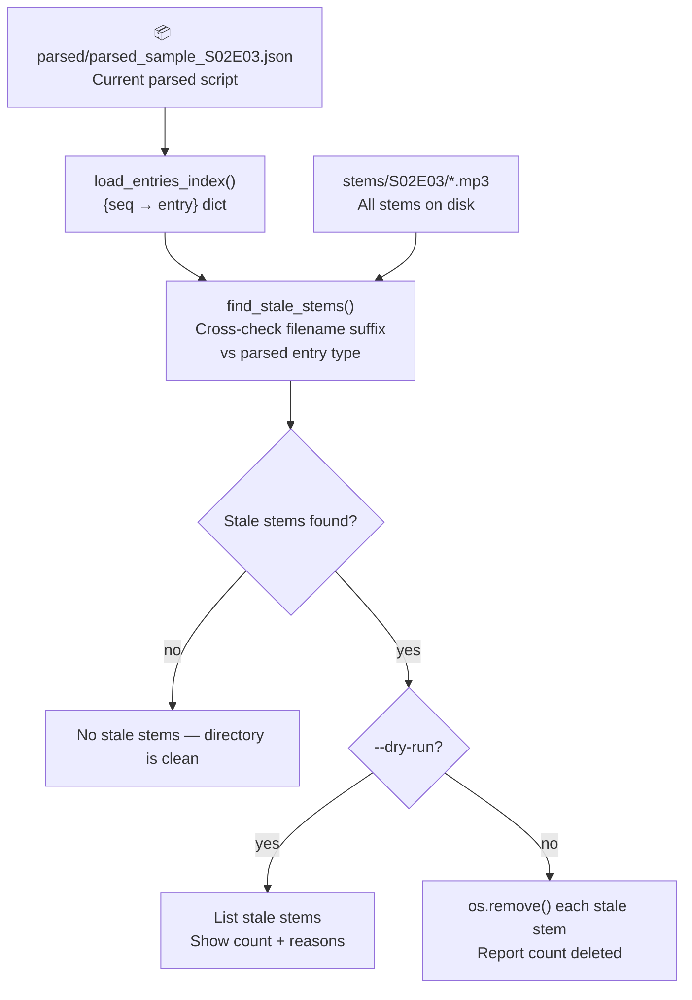
```mermaid
flowchart TD
    PARSED["`📦 parsed/parsed_sample_S02E03.json
    Current parsed script`"]
    STEMS["`stems/S02E03/*.mp3
    All stems on disk`"]

    LOAD["`load_entries_index()
    {seq → entry} dict`"]
    SCAN["`find_stale_stems()
    Cross-check filename suffix
    vs parsed entry type`"]

    PARSED --> LOAD --> SCAN
    STEMS --> SCAN

    SCAN --> RESULT{"Stale stems found?"}
    RESULT -->|no| CLEAN["No stale stems — directory is clean"]
    RESULT -->|yes| MODE{"--dry-run?"}
    MODE -->|yes| LIST["`List stale stems
    Show count + reasons`"]
    MODE -->|no| DELETE["`os.remove() each stale stem
    Report count deleted`"]
```

> **Relationship to XILP005 warnings:** Both XILP008 and `collect_stem_plans()` in
> `mix_common.py` detect stale stems via type mismatch, speaker mismatch, and seq
> deduplication.  Running XILP008 after migration eliminates the `[W] Stale stem skipped`
> warnings from XILP005.  XILP008 additionally catches stems whose seq is not present
> in the parsed JSON at all (orphaned stems), which XILP005 does not warn about.

## 15. XILU008 — Stem Log Report

Parses daily pipeline log files to reconstruct a chronological stem generation history.
Useful for auditing what was generated, when, with which backend, and confirming SHA256 checksums.

```bash
xil-stem-log --episode S03E03
xil-stem-log --episode S03E03 --since 2026-04-01 --output stem_log.csv
xil-stem-log --slug the413
xil-stem-log --logs-dir /path/to/logs
```

### Flow

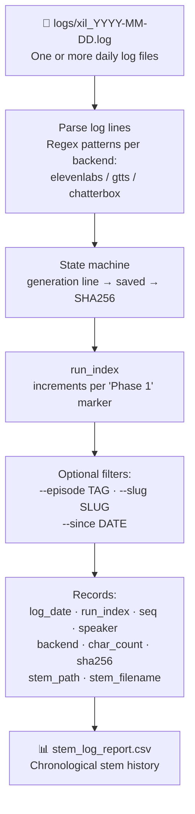
```mermaid
flowchart TD
    LOGS["`📂 logs/xil_YYYY-MM-DD.log
    One or more daily log files`"]
    PARSE["`Parse log lines
    Regex patterns per backend:
    elevenlabs / gtts / chatterbox`"]
    STATE["`State machine
    generation line → saved → SHA256`"]
    RUNIDX["`run_index
    increments per 'Phase 1' marker`"]
    FILTER["`Optional filters:
    --episode TAG · --slug SLUG
    --since DATE`"]
    RECORDS["`Records:
    log_date · run_index · seq · speaker
    backend · char_count · sha256
    stem_path · stem_filename`"]
    CSV["`📊 stem_log_report.csv
    Chronological stem history`"]

    LOGS --> PARSE --> STATE --> RUNIDX --> FILTER --> RECORDS --> CSV
```

> **`--episode TAG`** filters records to a specific episode tag (e.g. `S03E03`).
> **`--slug SLUG`** filters records to a specific show slug (e.g. `the413`).
> **`--since DATE`** filters to logs on or after the given date (YYYY-MM-DD format).
> **No API key required** — reads local log files only.

---

## 16. XILU009 — Workspace Migration

Moves pre-0.1.8 workspace files to the normalized layout introduced in 0.1.8. Idempotent —
re-running skips files already at their target path. Run once per existing workspace after
upgrading; new workspaces created by `xil-init` use the normalized layout automatically.

```bash
xil migrate-workspace --dry-run    # preview what would move
xil migrate-workspace              # execute moves
xil migrate-workspace --workspace /path/to/workspace
```

### Layout change summary

| Asset | Pre-0.1.8 (legacy) | 0.1.8+ (normalized) |
|-------|-------------------|----------------------|
| Cast config | `cast_{slug}_{tag}.json` (root) | `configs/{slug}/cast_{tag}.json` |
| SFX config | `sfx_{slug}_{tag}.json` (root) | `configs/{slug}/sfx_{tag}.json` |
| Parsed JSON | `parsed/parsed_{slug}_{tag}.json` | `parsed/{slug}/parsed_{tag}.json` |
| DAW layers | `daw/{tag}/` | `daw/{slug}/{tag}/` |
| Masters | `masters/{slug}_{tag}_master.mp3` | `masters/{slug}/{tag}_master.mp3` |
| Cues | `cues/cues_{slug}_{tag}.md` | `cues/{slug}/cues_{tag}.md` |
| Cues manifest | `cues/cues_manifest_{tag}.json` | `cues/{slug}/cues_manifest_{tag}.json` |
| Stems | `stems/{slug}/{tag}/` | unchanged |

### Flow

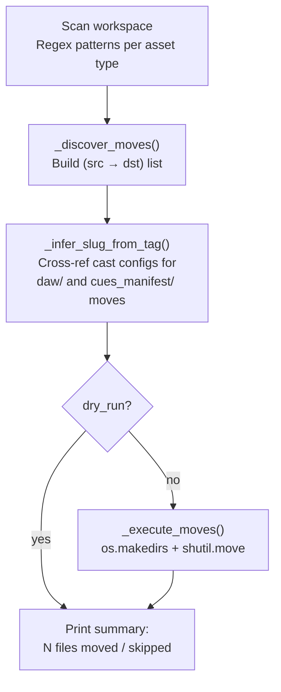
```mermaid
flowchart TD
    SCAN["`Scan workspace
    Regex patterns per asset type`"]
    DISCO["`_discover_moves()
    Build (src → dst) list`"]
    INFER["`_infer_slug_from_tag()
    Cross-ref cast configs for
    daw/ and cues_manifest/ moves`"]
    DRY{dry_run?}
    EXEC["`_execute_moves()
    os.makedirs + shutil.move`"]
    REPORT["`Print summary:
    N files moved / skipped`"]

    SCAN --> DISCO --> INFER --> DRY
    DRY -- yes --> REPORT
    DRY -- no --> EXEC --> REPORT
```

> **Backward compatibility**: `derive_paths()` automatically detects the legacy layout (root cast
> config present) and returns legacy paths, so existing workspaces continue to work without
> migration. Run `xil migrate-workspace` when ready to adopt the new layout.
> **No API key required** — local filesystem operations only.

---

## 17. XILP009 — Reverse Script Generator

Reconstructs a readable markdown production script from a parsed JSON, using cast config
for speaker display names.  Serves as a verification tool and produces a clean "revised"
version reflecting any post-parse edits.

```bash
xil regen --episode S02E03
xil regen --episode S02E03 --output scripts/revised_S02E03.md
```

### Flow

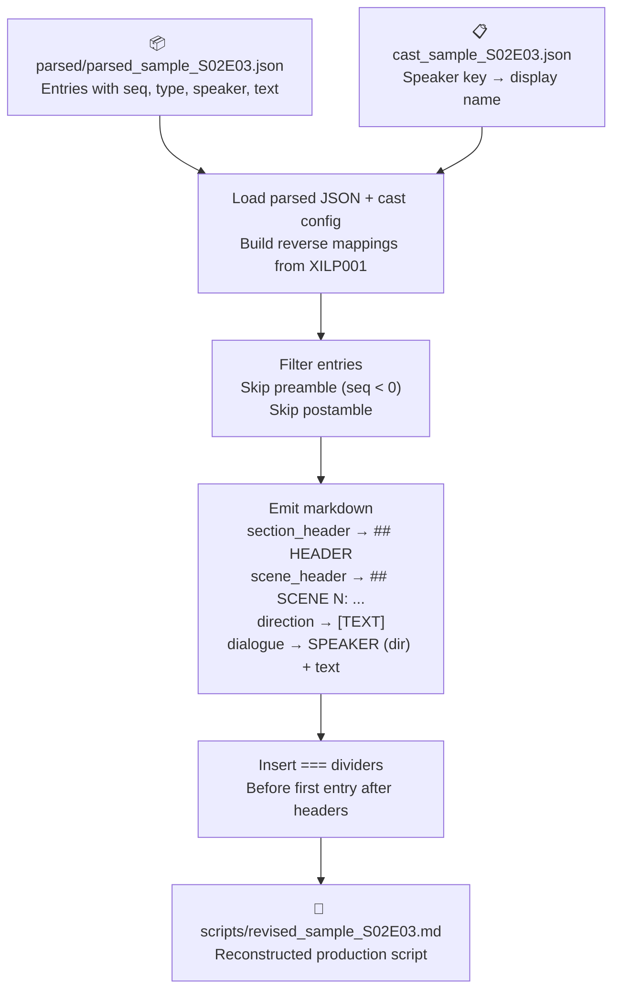
```mermaid
flowchart TD
    PARSED["`📦 parsed/parsed_sample_S02E03.json
    Entries with seq, type, speaker, text`"]
    CAST["`📋 cast_sample_S02E03.json
    Speaker key → display name`"]

    LOAD["`Load parsed JSON + cast config
    Build reverse mappings from XILP001`"]
    FILTER["`Filter entries
    Skip preamble (seq < 0)
    Skip postamble`"]
    EMIT["`Emit markdown
    section_header → ## HEADER
    scene_header → ## SCENE N: ...
    direction → [TEXT]
    dialogue → SPEAKER (dir) + text`"]
    DIVIDER["`Insert === dividers
    Before first entry after headers`"]

    PARSED --> LOAD
    CAST --> LOAD
    LOAD --> FILTER --> EMIT
    EMIT --> DIVIDER
    DIVIDER --> OUTPUT["`📄 scripts/revised_sample_S02E03.md
    Reconstructed production script`"]
```

> **Round-trip verification:** Parse the regenerated script with XILP001 and compare
> entry counts against the original parsed JSON.  Dialogue and direction counts should
> match exactly (excluding preamble/postamble entries injected by XILP002).
>
> **No API key required** — read-only transformation, no audio generated.

## 18. XILP010 — Studio Export Importer

Extracts dialogue stems from an ElevenLabs Studio export ZIP and renames them to the pipeline's stem naming convention (`{seq:03d}_{section}[-{scene}]_{speaker}.mp3`).

This provides an alternative to XILP002 voice generation: instead of calling the ElevenLabs TTS API per-line, an entire episode can be generated via ElevenLabs Studio (onboarded by XILP004), exported as a ZIP, and imported back into the pipeline with correct filenames.

```bash
xil import --episode S02E02 \
    --zip "ElevenLabs_exports/ElevenLabs_Working_with_Gen_S02E02_What_We_Carry_!.zip" --dry-run
xil import --episode S02E02 \
    --zip "ElevenLabs_exports/ElevenLabs_Working_with_Gen_S02E02_What_We_Carry_!.zip"
```

### Data flow

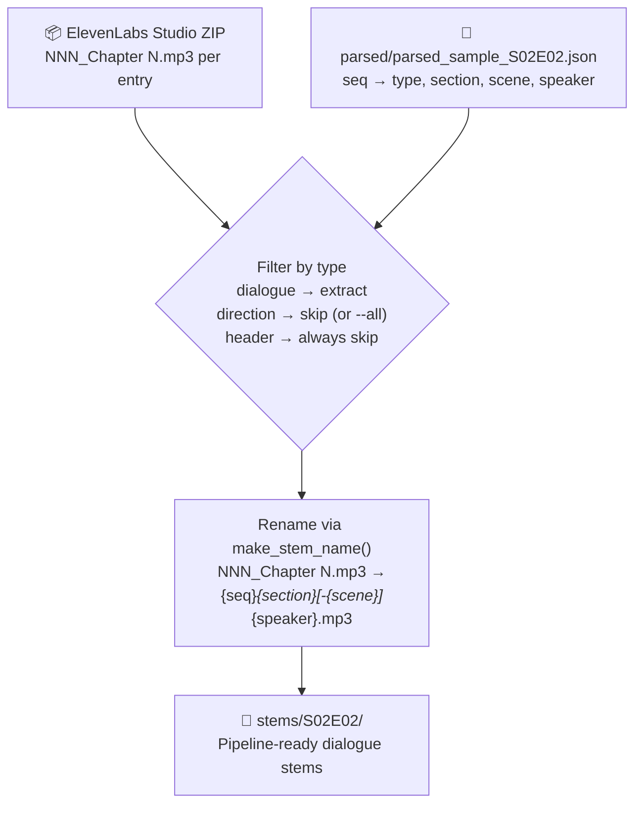
```mermaid
flowchart TD
    ZIP["`📦 ElevenLabs Studio ZIP
    NNN_Chapter N.mp3 per entry`"]
    PARSED["`📄 parsed/parsed_sample_S02E02.json
    seq → type, section, scene, speaker`"]
    FILTER{"`Filter by type
    dialogue → extract
    direction → skip (or --all)
    header → always skip`"}
    RENAME["`Rename via make_stem_name()
    NNN_Chapter N.mp3 →
    {seq}_{section}[-{scene}]_{speaker}.mp3`"]
    STEMS["`📂 stems/S02E02/
    Pipeline-ready dialogue stems`"]

    ZIP --> FILTER
    PARSED --> FILTER
    FILTER --> RENAME --> STEMS
```

> **No API key required** — extraction only, no API calls made.
> After import, run XILU002 for SFX stems and XILP002 for preamble/postamble injection.

## 19. XILP011 — Final Master MP3 Export

Overlays the four DAW layer WAV files produced by XILP005 into a single stereo MP3 file suitable for podcast distribution.

```bash
xil master --episode S02E03 --dry-run
xil master --episode S02E03
xil master --episode S02E03 --show "Night Owls"
```

### Data flow

```mermaid
flowchart TD
    DIALOGUE["`🎙️ daw/S02E03/
    S02E03_layer_dialogue.wav`"]
    AMBIENCE["`🌿 daw/S02E03/
    S02E03_layer_ambience.wav`"]
    MUSIC["`🎵 daw/S02E03/
    S02E03_layer_music.wav`"]
    SFX["`💥 daw/S02E03/
    S02E03_layer_sfx.wav`"]
    MIX["XILP011_master_export.py
    pydub overlay (unity gain)"]
    CAST["`📋 cast_sample_S02E03.json
    Show name, title, artist`"]
    MASTER["`🎧 masters/
    S02E03_sample_2026-03-24.mp3
    Stereo · 48 kHz · VBR ~145–185 kbps`"]

    DIALOGUE --> MIX
    AMBIENCE --> MIX
    MUSIC --> MIX
    SFX --> MIX
    CAST --> MIX
    MIX --> MASTER
```

> **No API key required** — local audio processing only.
> Mix balance is handled by XILP005; XILP011 overlays all four layers at unity gain.
> Output filename includes the run date: `{TAG}_{slug}_{YYYY-MM-DD}.mp3`.


## 20. XILP012 — Social Media Post Draft Generator

Reads a parsed episode JSON, builds a structured episode summary (cold open excerpt, cast list, section arc, runtime), and calls the Claude API (Haiku) to produce three ready-to-edit post variants. Output is an editable markdown file the producer reviews and pastes.

```bash
xil publish --episode S04E01 --dry-run
xil publish --episode S04E01
xil publish --episode S04E01 --platform instagram
xil publish --all
```

**Post variants per episode:**

| Variant | Description |
|---------|-------------|
| **Hype** | New episode announcement, teaser tone, no spoilers past cold open. Mentions show name, episode title, and Berkshire Talking Chronicle. |
| **Quote** | Pulls a memorable line from the cold open dialogue. Formatted as a blockquote with a tune-in call to action. |
| **Spotlight** | Features one cast member. Cycles by `(episode_number − 1) % cast_count` so each episode highlights a different character. |

### Data flow

```mermaid
flowchart TD
    PARSED["`📄 parsed/the413/
    parsed_S04E01.json
    (show, title, entries, stats)`"]
    CAST["`📋 configs/the413/
    cast_S04E01.json
    (full_name, role)`"]
    MASTER["`🎧 masters/the413/
    S04E01_master.mp3
    (runtime, optional)`"]
    EXTRACT["extract_episode_summary()
    cold open · cast · section arc"]
    PROMPT["build_user_message()
    structured episode brief"]
    CLAUDE["Claude API
    claude-haiku-4-5-20251001
    system prompt cached"]
    POSTS["`📝 posts/the413/
    S04E01_posts.md
    3 variants: Hype · Quote · Spotlight`"]

    PARSED --> EXTRACT
    CAST --> EXTRACT
    MASTER -.->|optional runtime| EXTRACT
    EXTRACT --> PROMPT
    PROMPT --> CLAUDE
    CLAUDE --> POSTS
```

### CLI flags

| Flag | Default | Description |
|------|---------|-------------|
| `--episode` / `--tag` | — | Episode tag (required unless `--all`) |
| `--show` | `project.json` | Show name override |
| `--platform` | `facebook` | `facebook` or `instagram` — affects prompt style |
| `--dry-run` | off | Print prompt + token estimate; no API call, no file written |
| `--all` | off | Batch-generate for every parsed episode under the current slug |
| `--model` | `claude-haiku-4-5-20251001` | Override Claude model ID |

> **`ANTHROPIC_API_KEY` required** for non-dry-run mode.
> Install the optional dependency first: `pip install 'xil-pipeline[publish]'`
> Prompt caching (`cache_control: ephemeral`) on the static system prompt reduces cost on `--all` batch runs.
> Output path: `posts/{slug}/{tag}_posts.md`


## Man Pages

All 22 CLI commands ship with Unix man pages, installed automatically when the package is pip-installed.

### Accessing man pages

After `pip install --user xil-pipeline`, pages land in `~/.local/share/man/man1/`. Add to `~/.bashrc`:

```bash
export MANPATH="$HOME/.local/share/man:$(manpath 2>/dev/null)"
```

Then use:

```bash
man xil-parse
man xil-produce
man xil           # dispatcher overview (lists all commands)
```

For system-wide installs (`sudo pip install`), pages land in `/usr/local/share/man/man1/` and are indexed by default.

### Regenerating man pages

Man pages are pre-generated from each command's `get_parser()` function and committed to `man/man1/`. Regenerate after any CLI flag changes:

```bash
pip install -e ".[dev]"      # includes argparse-manpage
python scripts/build_man.py  # regenerate all 18 argparse-based pages
```

The `xil.1` dispatcher page (`man/man1/xil.1`) is hand-crafted and must be updated manually when the dispatcher's command list changes.
