# XILP Pipeline Diagrams

Documentation of the nine-stage automated podcast production pipeline, including the cues sheet ingester pre-processing step, stem migration punch-in workflow, and stale stem cleanup.

---

## 1. End-to-End Overview

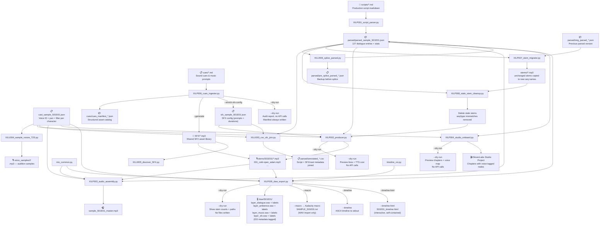
```mermaid
flowchart TD
    S["`📄 scripts/*.md
    Production script markdown`"]
    C["`📋 cast_sample_S01E01.json
    Voice ID + pan + filter per character`"]
    P1["XILP001_script_parser.py"]
    J["`📦 parsed/parsed_sample_S01E01.json
    127 dialogue entries + stats`"]

    CQ["`📋 cues/*.md
    Sound cues & music prompts`"]
    P6["XILP006_cues_ingester.py"]
    SFXCFG["`📋 sfx_sample_S01E01.json
    SFX config (prompts + durations)`"]
    SFXLIB["`🎵 SFX/*.mp3
    Shared SFX asset library`"]
    MNFST6["`📦 cues/cues_manifest_*.json
    Structured asset catalog`"]
    DRY6["`--dry-run
    Audit report, no API calls
    Manifest always written`"]

    P2["XILP002_producer.py"]
    P3["XILP003_audio_assembly.py"]
    DRY["`--dry-run
    Preview lines + TTS cost
    No API calls`"]
    ST["`🎙️ stems/S01E01/*.mp3
    001_cold-open_adam.mp3 …`"]
    OUT["🎧 sample_S01E01_master.mp3"]
    MIX["mix_common.py"]

    S --> P1 --> J
    CQ --> P6
    P6 --> MNFST6
    P6 -->|"--generate"| SFXLIB
    P6 -->|"--enrich-sfx-config"| SFXCFG
    P6 -->|"--dry-run"| DRY6
    SFXCFG --> P2
    SFXLIB --> ST

    XILU004["XILU004_sample_voices_T2S.py"]
    VSAMPLES["`🎙️ voice_samples/<TAG>/<backend>/
    <actor>.mp3 — audition samples`"]
    C --> XILU004
    XILU004 --> VSAMPLES

    XILU005["XILU005_discover_SFX.py"]
    SFXLIB --> XILU005

    XILU006["XILU006_splice_parsed.py"]
    JSPLICE["`📋 parsed/pre_splice_parsed_*.json
    Backup before splice`"]
    J --> XILU006
    XILU006 --> J
    XILU006 --> JSPLICE

    XILU003["XILU003_csv_sfx_join.py"]
    ANNOT["`📋 parsed/annotated_*.csv
    Script + SFX/cast metadata joined`"]
    J --> XILU003
    SFXCFG --> XILU003
    C --> XILU003
    XILU003 --> ANNOT

    P7["XILP007_stem_migrator.py"]
    JORIG["`📦 parsed/orig_parsed_*.json
    Previous parsed version`"]
    MIGR["`stems/<TAG>/*.mp3
    unchanged stems copied to new seq names`"]
    JORIG --> P7
    J --> P7
    P7 --> MIGR

    P8["XILP008_stale_stem_cleanup.py"]
    CLEAN["`Delete stale stems
    seq/type mismatches removed`"]
    MIGR --> P8
    J --> P8
    P8 --> CLEAN
    CLEAN --> P2

    C --> P2
    J --> P2
    P2 -->|"--dry-run"| DRY
    P2 --> ST
    C --> P3
    ST --> P3
    J --> P3
    MIX --> P3
    P3 --> OUT

    P4["XILP004_studio_onboard.py"]
    STUDIO["`🎬 ElevenLabs Studio Project
    Chapters with voice-tagged nodes`"]
    DRY4["`--dry-run
    Preview chapters + voice map
    No API calls`"]

    J --> P4
    C --> P4
    P4 -->|"--dry-run"| DRY4
    P4 --> STUDIO

    P5["XILP005_daw_export.py"]
    VIZ["timeline_viz.py"]
    DAW["`🎚️ daw/S01E01/
    layer_dialogue.wav + labels
    layer_ambience.wav + labels
    layer_music.wav + labels
    layer_sfx.wav + labels
    (ID3 metadata tagged)`"]
    DRY5["`--dry-run
    Show stem counts + paths
    No files written`"]
    MACRO["`--macro → Audacity macro
    SAMPLE_S01E01.txt
    (WAV import only)`"]
    TL5["`--timeline
    ASCII timeline to stdout`"]
    TLHTML5["`--timeline-html
    S01E01_timeline.html
    (interactive, self-contained)`"]

    ST --> P5
    J --> P5
    C --> P5
    MIX --> P5
    VIZ --> P5
    P5 -->|"--dry-run"| DRY5
    P5 --> DAW
    P5 -->|"--macro"| MACRO
    P5 -->|"--timeline"| TL5
    P5 -->|"--timeline-html"| TLHTML5
```

---

## 2. XILP001 — Script Parser Internals

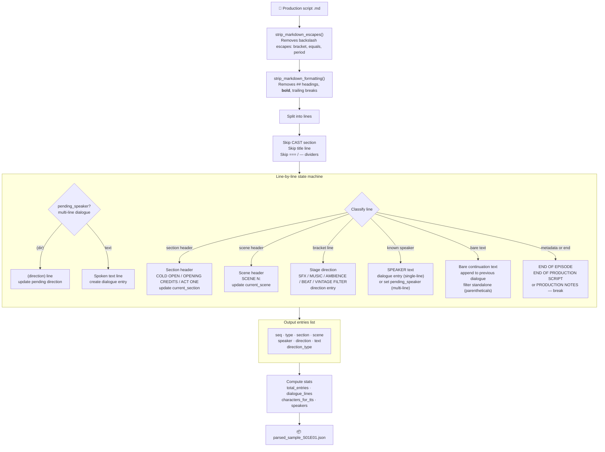
```mermaid
flowchart TD
    IN["📄 Production script .md"]
    ESC["`strip_markdown_escapes()
    Removes backslash escapes: bracket, equals, period`"]
    FMT["`strip_markdown_formatting()
    Removes ## headings, **bold**, trailing breaks`"]
    LINES["Split into lines"]
    SKIP["`Skip CAST section
    Skip title line
    Skip === / --- dividers`"]

    LINES --> SKIP --> LOOP

    subgraph LOOP["Line-by-line state machine"]
        direction TB
        PEND{"`pending_speaker?
        multi-line dialogue`"}
        PDIR["`(direction) line
        update pending direction`"]
        PTXT["`Spoken text line
        create dialogue entry`"]
        CHK{"Classify line"}
        SEC["`Section header
        COLD OPEN / OPENING CREDITS / ACT ONE
        update current_section`"]
        SCN["`Scene header
        SCENE N:
        update current_scene`"]
        DIR["`Stage direction
        SFX / MUSIC / AMBIENCE / BEAT / VINTAGE FILTER
        direction entry`"]
        DLG["`SPEAKER text
        dialogue entry (single-line)
        or set pending_speaker (multi-line)`"]
        CONT["`Bare continuation text
        append to previous dialogue
        filter standalone (parentheticals)`"]
        STOP["`END OF EPISODE
        END OF PRODUCTION SCRIPT
        or PRODUCTION NOTES — break`"]

        PEND -->|"(dir)"| PDIR
        PEND -->|text| PTXT
        CHK -->|section header| SEC
        CHK -->|scene header| SCN
        CHK -->|bracket line| DIR
        CHK -->|known speaker| DLG
        CHK -->|bare text| CONT
        CHK -->|metadata or end| STOP
    end

    IN --> ESC --> FMT --> LINES
    LOOP --> ENTRIES

    subgraph ENTRIES["Output entries list"]
        direction LR
        E1["`seq · type · section · scene
        speaker · direction · text
        direction_type`"]
    end

    ENTRIES --> STATS["`Compute stats
    total_entries · dialogue_lines
    characters_for_tts · speakers`"]
    STATS --> JSON["📦 parsed_sample_S01E01.json"]
```

### Speaker normalization

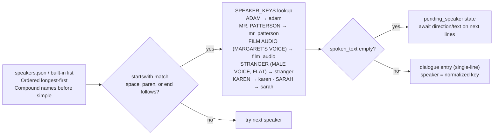
```mermaid
flowchart LR
    RAW["`speakers.json / built-in list
    Ordered longest-first
    Compound names before simple`"]
    RAW --> MATCH{"`startswith match
    space, paren, or end follows?`"}
    MATCH -->|yes| KEY["`SPEAKER_KEYS lookup
    ADAM → adam
    MR. PATTERSON → mr_patterson
    FILM AUDIO (MARGARET'S VOICE) → film_audio
    STRANGER (MALE VOICE, FLAT) → stranger
    KAREN → karen · SARAH → sarah`"]
    MATCH -->|no| SKIP2["try next speaker"]
    KEY --> MODE{"`spoken_text empty?`"}
    MODE -->|yes| PEND["`pending_speaker state
    await direction/text on next lines`"]
    MODE -->|no| ENTRY["`dialogue entry (single-line)
    speaker = normalized key`"]
```

---

## 3. XILP002 — Voice Generation

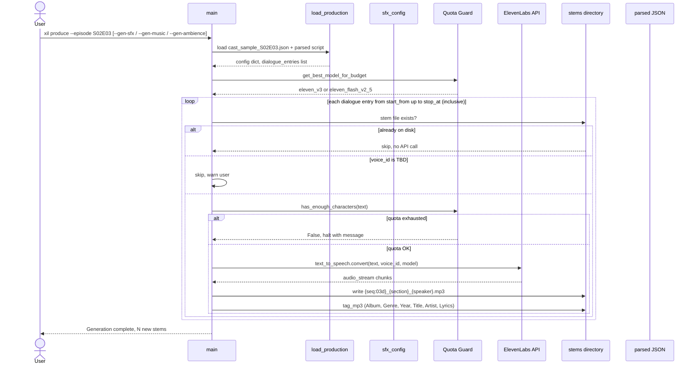
```mermaid
sequenceDiagram
    actor User
    participant M as main
    participant LP as load_production
    participant SFX as sfx_config
    participant QG as Quota Guard
    participant API as ElevenLabs API
    participant FS as stems directory
    participant PJ as parsed JSON

    User->>M: xil produce --episode S02E03 [--gen-sfx / --gen-music / --gen-ambience]
    M->>LP: load cast_sample_S02E03.json + parsed script
    LP-->>M: config dict, dialogue_entries list
    M->>QG: get_best_model_for_budget
    QG-->>M: eleven_v3 or eleven_flash_v2_5

    loop each dialogue entry from start_from up to stop_at (inclusive)
        M->>FS: stem file exists?
        alt already on disk
            FS-->>M: skip, no API call
        else voice_id is TBD
            M->>M: skip, warn user
        else
            M->>QG: has_enough_characters(text)
            alt quota exhausted
                QG-->>M: False, halt with message
            else quota OK
                M->>API: text_to_speech.convert(text, voice_id, model)
                API-->>M: audio_stream chunks
                M->>FS: write {seq:03d}_{section}_{speaker}.mp3
                M->>FS: tag_mp3 (Album, Genre, Year, Title, Artist, Lyrics)
            end
        end
    end

    M-->>User: Generation complete, N new stems
```

> **Range control:** `--start-from N` resumes an interrupted run by skipping entries with seq < N.
> `--stop-at N` halts after seq N (inclusive). Combine them (`--start-from 50 --stop-at 80`) to
> regenerate a specific scene without touching the rest of the episode.

> **Draft mode:** `--backend gtts` routes all dialogue voice stems through Google Translate TTS
> at no cost — all characters use the same flat voice, useful for checking episode duration before
> spending ElevenLabs credits. No API key required. eleven_v3 inline tags are stripped automatically.
> SFX/music/ambience generation is unaffected. Requires: `pip install xil-pipeline[tts-alt]`

> **SFX backend (independent of dialogue):** `--sfx-backend elevenlabs|audioldm2` (default
> `elevenlabs`) selects the generator for SFX/MUSIC/AMBIENCE, orthogonal to the dialogue
> `--backend`. `audioldm2` runs a local **AudioLDM 2 Large** diffusion model in its own
> `venv-audioldm2/` (driven by `audioldm2_worker.py`, same persistent JSON-over-stdio subprocess
> pattern as Chatterbox) — free, GPU-accelerated, no API credits. Model-generated assets are
> stored backend-tagged (`SFX/<slug>.audioldm2.mp3`) so ElevenLabs and AudioLDM 2 audio coexist
> and a backend switch never silently reuses the wrong file. Tunables: `--audioldm2-guidance`
> (prompt adherence, default 3.5), `--audioldm2-steps` (default 200), `--audioldm2-negative-prompt`,
> `--audioldm2-python` (auto-detected). Generation is delegated through the `SfxBackend` adapter in
> `sfx_backends.py`, which both `xil-produce` and `xil-sfx` share.

---

## 4. XILP003 — Audio Assembly (Two-Pass Multi-Track Mix)

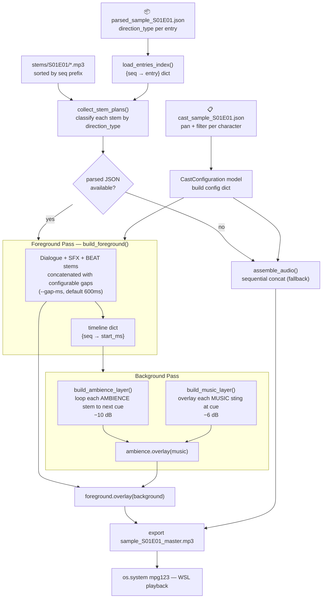
```mermaid
flowchart TD
    C2["`📋 cast_sample_S01E01.json
    pan + filter per character`"]
    J2["`📦 parsed_sample_S01E01.json
    direction_type per entry`"]
    ST2["`stems/S01E01/*.mp3
    sorted by seq prefix`"]

    C2 --> CFG_LOAD["`CastConfiguration model
    build config dict`"]
    J2 --> IDX["`load_entries_index()
    {seq → entry} dict`"]
    ST2 --> PLANS["`collect_stem_plans()
    classify each stem by direction_type`"]
    IDX --> PLANS

    PLANS --> BRANCH{"parsed JSON\navailable?"}

    BRANCH -->|no| SEQ["`assemble_audio()
    sequential concat (fallback)`"]

    BRANCH -->|yes| FG

    subgraph FG["Foreground Pass — build_foreground()"]
        direction TB
        FG1["`Dialogue + SFX + BEAT stems
        concatenated with configurable gaps
        (--gap-ms, default 600ms)`"]
        FG2["`timeline dict
        {seq → start_ms}`"]
        FG1 --> FG2
    end

    subgraph BG["Background Pass"]
        direction TB
        AMB["`build_ambience_layer()
        loop each AMBIENCE stem to next cue
        −10 dB`"]
        MUS["`build_music_layer()
        overlay each MUSIC sting at cue
        −6 dB`"]
        AMB --> BGMIX["ambience.overlay(music)"]
        MUS --> BGMIX
    end

    FG2 --> BG
    FG1 --> OVERLAY["foreground.overlay(background)"]
    BGMIX --> OVERLAY

    OVERLAY --> EXPORT2["export sample_S01E01_master.mp3"]
    SEQ --> EXPORT2
    EXPORT2 --> PLAY2["os.system mpg123 — WSL playback"]

    CFG_LOAD --> FG
    CFG_LOAD --> SEQ
```

> **Vintage filter (scene-scoped):** Add `"vintage_scenes": ["scene-3", "scene-4"]` to the
> SFX config to apply a 1960s-era audio filter (HF roll-off + −1 dB) to all dialogue in
> those scenes. The scene label must match the `scene` field in the parsed JSON.
> Tape hiss or other ambient texture for the flashback is handled separately as a looped
> AMBIENCE entry — no code change needed.

> **Restartability:** XILP003 has no ElevenLabs dependency. Re-running assembly after adjusting
> effects or adding missing stems requires no API key and carries no TTS quota risk.

> **Runtime control:** `--gap-ms N` sets the silence between foreground stems (default 600ms).
> With 294 stems in S02E03, reducing to 300ms saves ~1.5 min; to 200ms saves ~2 min.

---

## 5. XILP004 — Studio Project Onboarding

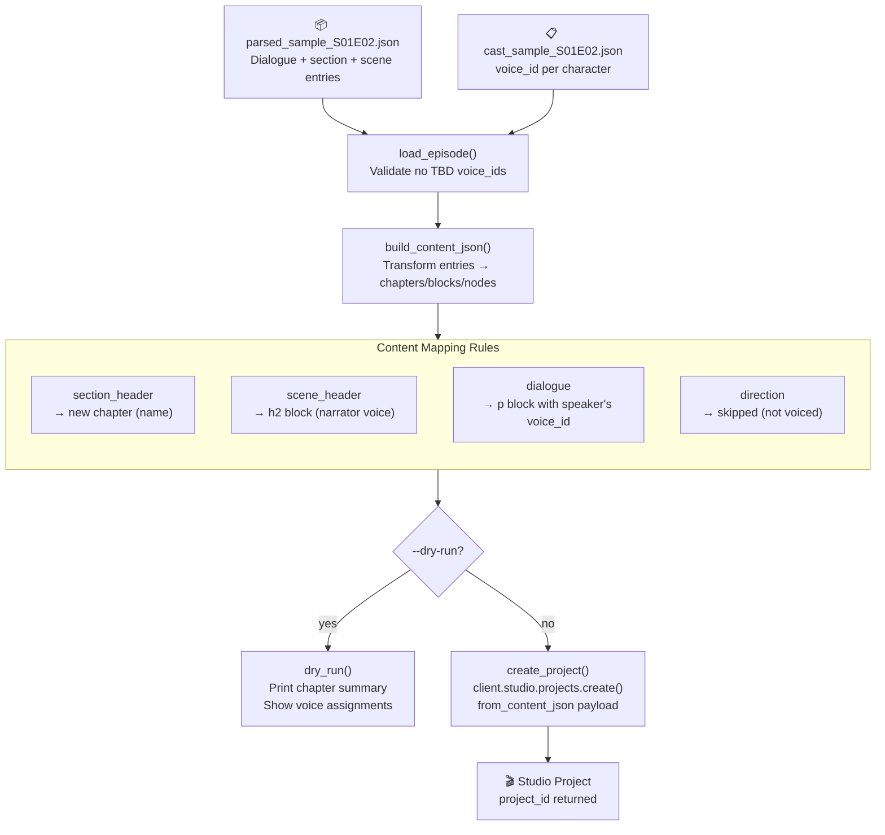
```mermaid
flowchart TD
    PARSED["`📦 parsed_sample_S01E02.json
    Dialogue + section + scene entries`"]
    CAST["`📋 cast_sample_S01E02.json
    voice_id per character`"]

    LOAD["`load_episode()
    Validate no TBD voice_ids`"]
    BUILD["`build_content_json()
    Transform entries → chapters/blocks/nodes`"]

    PARSED --> LOAD
    CAST --> LOAD
    LOAD --> BUILD

    subgraph MAPPING["Content Mapping Rules"]
        direction TB
        SEC["`section_header
        → new chapter (name)`"]
        SCN["`scene_header
        → h2 block (narrator voice)`"]
        DLG["`dialogue
        → p block with speaker's voice_id`"]
        DIR["`direction
        → skipped (not voiced)`"]
    end

    BUILD --> MAPPING
    MAPPING --> MODE{"--dry-run?"}
    MODE -->|yes| DRY["`dry_run()
    Print chapter summary
    Show voice assignments`"]
    MODE -->|no| API["`create_project()
    client.studio.projects.create()
    from_content_json payload`"]
    API --> PROJ["`🎬 Studio Project
    project_id returned`"]
```

> **Speaker-name problem solved:** Each `tts_node` carries its own `voice_id` — speaker names
> never appear in the text, so TTS won't voice them. No manual post-creation cleanup needed.

---

## 6. Stem File Naming Convention

### Standard stems (seq ≥ 1)

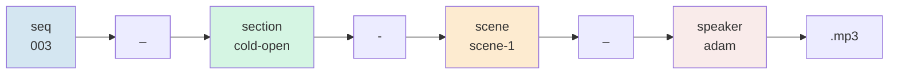
```mermaid
flowchart LR
    SEQ["`seq
    003`"]
    SEP1["_"]
    SEC["`section
    cold-open`"]
    SEP2["-"]
    SCN["`scene
    scene-1`"]
    SEP3["_"]
    SPK["`speaker
    adam`"]
    EXT[".mp3"]

    SEQ --> SEP1 --> SEC --> SEP2 --> SCN --> SEP3 --> SPK --> EXT

    style SEQ fill:#d4e6f1
    style SEC fill:#d5f5e3
    style SCN fill:#fdebd0
    style SPK fill:#f9ebea
```

**Example:** `003_cold-open_adam.mp3`, `028_act1-scene-1_rian.mp3`, `102_act2-scene-5_mr_patterson.mp3`

### Preamble and postamble stems

Preamble and postamble entries appear in the production script as `PREAMBLE` and `POSTAMBLE`
section blocks. Because they are parsed like any other section, their seq numbers are
contiguous with the episode — no special prefix. Stems follow the standard naming pattern:

```
001_preamble_tina.mp3      ← dialogue stem (broadcast intro voice)
002_preamble_sfx.mp3       ← SFX stem (INTRO MUSIC direction)
…
306_postamble_sfx.mp3      ← SFX stem (OUTRO MUSIC direction)
307_postamble_tina.mp3     ← dialogue stem (broadcast outro voice)
```

TTS speed for preamble/postamble stems is taken from the `preamble`/`postamble` block in
the cast config (`speed` field); all other voice settings come from the speaker's `cast`
entry. The `INTRO MUSIC` and `OUTRO MUSIC` stems are generated by `xil sfx` via the
standard SFX pipeline.

---

## 7. API Cost Guard Flow

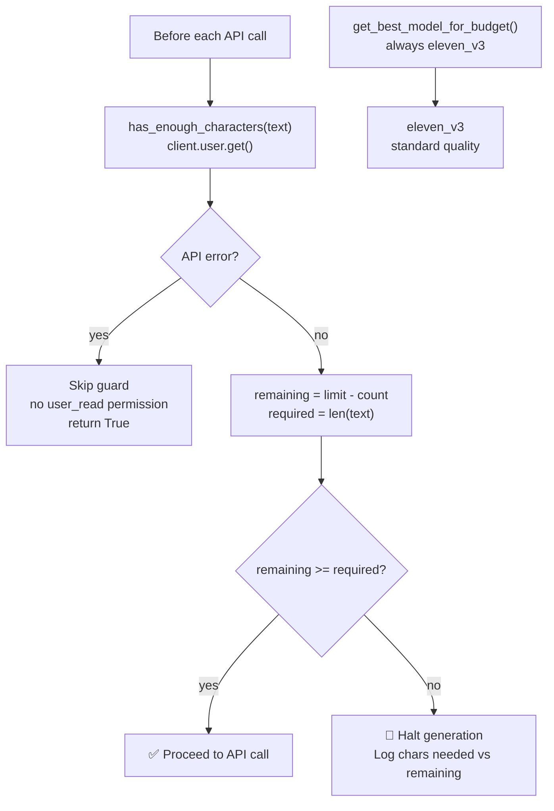
```mermaid
flowchart TD
    START["Before each API call"]
    CHK["`has_enough_characters(text)
    client.user.get()`"]
    ERR{"API error?"}
    SKIP_GUARD["`Skip guard
    no user_read permission
    return True`"]
    CALC["`remaining = limit - count
    required = len(text)`"]
    CMP{"remaining >= required?"}
    OK["✅ Proceed to API call"]
    HALT["`🛑 Halt generation
    Log chars needed vs remaining`"]

    START --> CHK --> ERR
    ERR -->|yes| SKIP_GUARD
    ERR -->|no| CALC --> CMP
    CMP -->|yes| OK
    CMP -->|no| HALT

    BUDGET["`get_best_model_for_budget()
    always eleven_v3`"]
    V3["`eleven_v3
    standard quality`"]

    BUDGET --> V3
```

---

## 8. XILP005 — DAW Layer Export

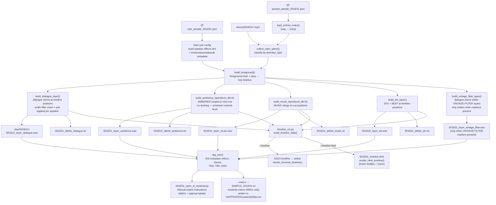
```mermaid
flowchart TD
    C5["`📋 cast_sample_S01E01.json`"]
    J5["`📦 parsed_sample_S01E01.json`"]
    ST5["`stems/S01E01/*.mp3`"]

    C5 --> L5["`load cast config
    build speaker effects dict
    + show/season/episode metadata`"]
    J5 --> IDX5["`load_entries_index()
    {seq → entry}`"]
    ST5 --> PLANS5["`collect_stem_plans()
    classify by direction_type`"]
    IDX5 --> PLANS5

    PLANS5 --> TL5

    TL5["`build_foreground()
    foreground track + {seq → ms} timeline`"]
    L5 --> TL5

    TL5 --> DLG5["`build_dialogue_layer()
    dialogue stems at timeline positions
    audio filter chain + pan applied per speaker`"]
    TL5 --> AMB5["`build_ambience_layer(level_db=0)
    AMBIENCE looped to next cue
    no ducking — producer controls level`"]
    TL5 --> MUS5["`build_music_layer(level_db=0)
    MUSIC stings at cue positions`"]
    TL5 --> SFX5["`build_sfx_layer()
    SFX + BEAT at timeline positions`"]

    TL5 --> VF5["`build_vintage_filter_layer()
    dialogue stems within VINTAGE FILTER spans
    only written when markers present`"]

    DLG5 --> WAV1["`daw/S01E01/
    S01E01_layer_dialogue.wav`"]
    AMB5 --> WAV2["S01E01_layer_ambience.wav"]
    MUS5 --> WAV3["S01E01_layer_music.wav"]
    SFX5 --> WAV4["S01E01_layer_sfx.wav"]
    VF5 --> WAV5["`S01E01_layer_vintage_filter.wav
    (only when VINTAGE FILTER markers present)`"]

    WAV1 --> TAG5["`tag_wav()
    ID3 metadata: Album, Genre,
    Year, Title, Artist`"]
    WAV2 --> TAG5
    WAV3 --> TAG5
    WAV4 --> TAG5
    WAV5 --> TAG5

    DLG5 --> LBL1["S01E01_labels_dialogue.txt"]
    AMB5 --> LBL2["S01E01_labels_ambience.txt"]
    MUS5 --> LBL3["S01E01_labels_music.txt"]
    SFX5 --> LBL4["S01E01_labels_sfx.txt"]

    TAG5 --> SCRIPT5["`S01E01_open_in_audacity.py
    Manual import instructions
    (WAVs + optional labels)`"]
    TAG5 --> MACRO5["`--macro → SAMPLE_S01E01.txt
    Audacity macro (WAVs only)
    written to %APPDATA%/audacity/Macros/`"]

    DLG5 --> TLVIZ["`timeline_viz.py
    build_timeline_data()`"]
    AMB5 --> TLVIZ
    MUS5 --> TLVIZ
    SFX5 --> TLVIZ
    TLVIZ -->|"--timeline"| ASCII5["`ASCII timeline → stdout
    render_terminal_timeline()`"]
    TLVIZ -->|"--timeline-html"| HTML5["`S01E01_timeline.html
    render_html_timeline()
    (hover tooltips + zoom)`"]
```

> **Audacity alignment:** All generated WAV layer files are exactly the same duration (full episode length).
> Importing them into Audacity at t=0 produces perfectly aligned tracks — no repositioning
> or time-offset metadata required.

> **Audio metadata:** Each WAV layer is tagged with ID3 metadata (Album = show name, Genre = "Podcast",
> Year, Title = e.g. "S02E03 Dialogue", Artist = season title) via `tag_wav()` from `sfx_common.py`.

> **Label tracks:** Audacity-format label files (tab-separated start/end/text) are generated alongside
> each WAV layer. Import labels separately via `File > Import > Labels...` in Audacity.

> **Audacity macro:** `--macro` writes a one-click macro (`<SLUG>_<TAG>.txt`) to the Audacity Macros
> directory. The macro imports the WAV layer files only (labels are imported manually). Access via
> `Tools > Macros` in Audacity.

> **Preamble/postamble support:** Preamble and postamble dialogue stems are generated by the
> standard `generate_voices()` loop — no special handling. The `preamble`/`postamble` blocks
> in the cast config supply a `speed` override for those sections only. Music stems (`INTRO
> MUSIC`, `OUTRO MUSIC`) are generated by `xil sfx` and have `foreground_override = True` so
> they play sequentially rather than as background overlays.

> **Timeline visualization:** `--timeline` prints an ASCII multitrack view to stdout; `--timeline-html`
> writes a self-contained HTML file with color-coded swim lanes, hover tooltips, and Ctrl+scroll zoom.
> Both work with `--dry-run` — the dry-run path uses `build_foreground_timeline_only()` (mutagen
> header reads, no audio decoding) and the `compute_*_labels()` helpers in `mix_common.py`.

> **Note on mod-script-pipe:** The generated helper script includes pipe automation code, but
> Audacity 3.7.x does not reliably initialise mod-script-pipe on Windows. The Audacity macro
> (`--macro`) is the recommended automation path.

> **Auto-save:** Add `--save-aup3` to append a `SaveProject2` command at the end of
> `{TAG}_open_in_audacity.py`.  This requires mod-script-pipe to be active and will save the
> project as an `.aup3` file immediately after import.  Only useful when pipe automation is
> confirmed working; otherwise omit this flag and save manually.

---

## 9. XILP006 — Cues Sheet Ingester

Pre-processing step that bridges a human-authored sound cues & music prompts document into the
automated pipeline.  Sits **after XILP001** and **before XILU002 / XILP002** — enriching the SFX
config and populating the shared asset library before stem generation begins.

### 9a. Overall flow

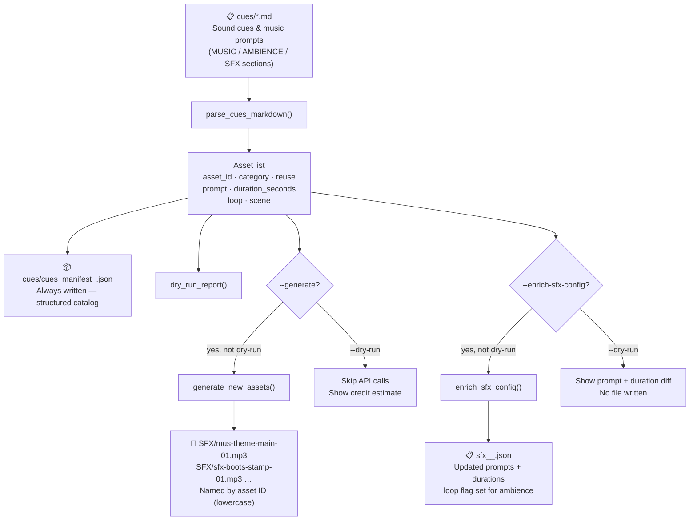
```mermaid
flowchart TD
    CQ["`📋 cues/*.md
    Sound cues & music prompts
    (MUSIC / AMBIENCE / SFX sections)`"]
    PARSE["parse_cues_markdown()"]
    ASSETS["`Asset list
    asset_id · category · reuse
    prompt · duration_seconds
    loop · scene`"]
    MANIFEST["`📦 cues/cues_manifest_<TAG>.json
    Always written — structured catalog`"]
    AUDIT["dry_run_report()"]

    CQ --> PARSE --> ASSETS
    ASSETS --> MANIFEST
    ASSETS --> AUDIT

    ASSETS --> GEN_BRANCH{"--generate?"}
    GEN_BRANCH -->|"yes, not dry-run"| GEN["generate_new_assets()"]
    GEN_BRANCH -->|"--dry-run"| SKIP_GEN["`Skip API calls
    Show credit estimate`"]
    GEN --> SFXLIB["`🎵 SFX/mus-theme-main-01.mp3
    SFX/sfx-boots-stamp-01.mp3 …
    Named by asset ID (lowercase)`"]

    ASSETS --> ENR_BRANCH{"--enrich-sfx-config?"}
    ENR_BRANCH -->|"yes, not dry-run"| ENR["enrich_sfx_config()"]
    ENR_BRANCH -->|"--dry-run"| DIFF["`Show prompt + duration diff
    No file written`"]
    ENR --> SFXCFG["`📋 sfx_<slug>_<TAG>.json
    Updated prompts + durations
    loop flag set for ambience`"]
```

### 9b. Cues markdown parsing

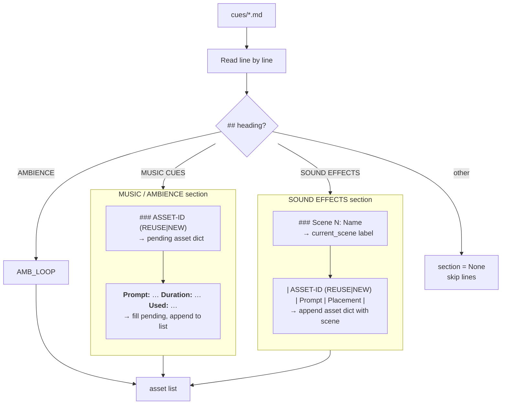
```mermaid
flowchart TD
    MD["cues/*.md"]
    SEC{"`## heading?`"}

    MD --> LINES["Read line by line"]
    LINES --> SEC

    SEC -->|"MUSIC CUES"| MUSIC_LOOP
    SEC -->|"AMBIENCE"| AMB_LOOP
    SEC -->|"SOUND EFFECTS"| SFX_LOOP
    SEC -->|"other"| NULL["section = None\nskip lines"]

    subgraph MUSIC_LOOP["MUSIC / AMBIENCE section"]
        direction TB
        H3["`### ASSET-ID (REUSE|NEW)
        → pending asset dict`"]
        PLINE["`**Prompt:** … **Duration:** … **Used:** …
        → fill pending, append to list`"]
        H3 --> PLINE
    end

    subgraph SFX_LOOP["SOUND EFFECTS section"]
        direction TB
        SCENE_H["`### Scene N: Name
        → current_scene label`"]
        ROW["`| ASSET-ID (REUSE|NEW) | Prompt | Placement |
        → append asset dict with scene`"]
        SCENE_H --> ROW
    end

    MUSIC_LOOP --> OUT2["asset list"]
    AMB_LOOP --> OUT2
    SFX_LOOP --> OUT2
```

### 9c. Library audit status codes

| Status | Meaning |
|--------|---------|
| `EXISTS` | `SFX/<asset-id>.mp3` is present and non-empty |
| `REUSE` | Asset is marked *(REUSE)* in the cues sheet but not yet in `SFX/` — must be sourced or regenerated |
| `NEW` | Asset is marked *(NEW)* — needs ElevenLabs API generation via `--generate` |

### 9d. SFX config enrichment matching

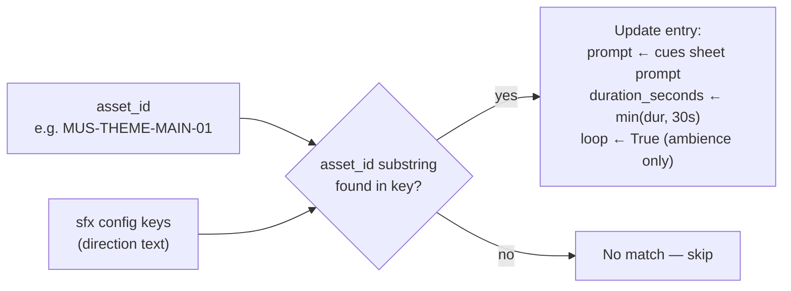
```mermaid
flowchart LR
    AID["`asset_id
    e.g. MUS-THEME-MAIN-01`"]
    KEYS["`sfx config keys
    (direction text)`"]
    MATCH{"`asset_id substring
    found in key?`"}
    UPDATE["`Update entry:
    prompt ← cues sheet prompt
    duration_seconds ← min(dur, 30s)
    loop ← True (ambience only)`"]
    SKIP["No match — skip"]

    AID --> MATCH
    KEYS --> MATCH
    MATCH -->|yes| UPDATE
    MATCH -->|no| SKIP
```

> **Duration cap:** ElevenLabs Sound Effects API accepts at most 30 seconds per call.
> Assets with longer cues-sheet durations (e.g. 3-minute underscore) are generated at 30s
> and flagged `[CAPPED]` in the audit report.  Looping in XILP003/XILP005 handles extension.

### 9e. Recommended run order for a new episode

```bash
# 1. Parse script and generate skeleton configs
xil scan "scripts/<script>.md"          # pre-flight: catch unknown speakers
xil parse "scripts/<script>.md" --episode S02E03

# 1b. (Optional) Review full episode structure before any API spend
xil csv-join --episode S02E03                 # annotated CSV: SFX + cast columns

# 2. Ingest cues sheet — enrich sfx config + audit (no API calls yet)
xil cues --episode S02E03 \
    --cues "cues/<cues-file>.md" --enrich-sfx-config

# 3. Preview what needs generating
xil cues --episode S02E03 \
    --cues "cues/<cues-file>.md" --generate --dry-run

# 4. Generate new SFX/music assets into SFX/ library
xil cues --episode S02E03 \
    --cues "cues/<cues-file>.md" --generate

# 5. Generate voice stems (sfx config already enriched)
#    Preamble: ensure sfx_<slug>_S02E03.json contains an "INTRO MUSIC" entry with a "source" path
#    Preamble/postamble text lives in the script PREAMBLE/POSTAMBLE sections; sfx config needs INTRO MUSIC + OUTRO MUSIC entries
xil produce --episode S02E03 --dry-run
xil produce --episode S02E03
# Generate SFX/music/ambience stems by category (omit flags to generate all):
xil sfx --episode S02E03 --gen-sfx --dry-run
xil sfx --episode S02E03 --gen-music --dry-run
xil sfx --episode S02E03 --gen-ambience --dry-run
xil sfx --episode S02E03
# Or generate SFX/music/ambience locally for free with AudioLDM 2 (needs venv-audioldm2/):
xil sfx --episode S02E03 --sfx-backend audioldm2 --gen-sfx --dry-run
xil sfx --episode S02E03 --sfx-backend audioldm2

# 6. Assemble master MP3 or export DAW layers
xil assemble --episode S02E03
xil daw --episode S02E03 --macro

# 7. Inspect asset placement (no audio decode needed with --dry-run)
xil daw --episode S02E03 --dry-run --timeline
xil daw --episode S02E03 --timeline --timeline-html
```

### 9f. Punch-in run order (script revised after full generation)

```bash
# 1. Re-parse the revised script (preserves orig_ as the old reference)
xil parse "scripts/<revised>.md" --episode S02E03

# 2. Migrate unchanged stems to new seq-numbered filenames
xil migrate --episode S02E03 --dry-run   # preview first
xil migrate --episode S02E03

# 2b. Clean up stale stems left behind by migration
xil cleanup --episode S02E03 --dry-run  # preview first
xil cleanup --episode S02E03

# 3. Generate only the gaps (XILP002 skips files already on disk)
xil produce --episode S02E03 --dry-run
xil produce --episode S02E03

# 4. Reassemble
xil assemble --episode S02E03
xil daw --episode S02E03 --macro
```

---

## 10. Timeline Visualization (`timeline_viz.py`)

Shared module that renders asset placement across all DAW layers without any pydub dependency.
Consumed by XILP005 via `--timeline` and `--timeline-html`.

### 10a. Data model

`timeline_viz.py` is built on two dataclasses — full field listing in [§27e](#27e-pipeline-utility-models).

| Class | Role |
|-------|------|
| `TimelineData` | Episode container — tag, total duration, four named `LayerSpan` lists keyed by layer |
| `LayerSpan` | One asset placement — start/end time, label, optional ramp-in/out, volume, play-duration, tooltip snippet |

### 10b. Rendering paths

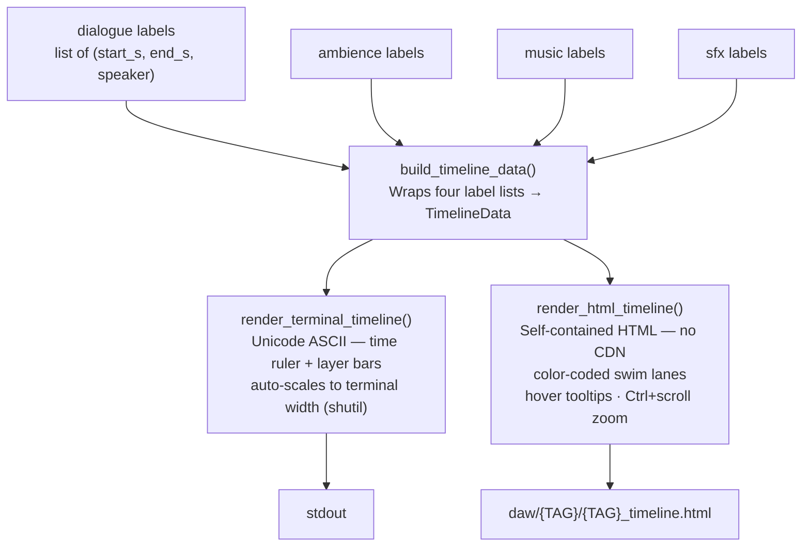
```mermaid
flowchart TD
    DLG_L["`dialogue labels
    list of (start_s, end_s, speaker)`"]
    AMB_L["`ambience labels`"]
    MUS_L["`music labels`"]
    SFX_L["`sfx labels`"]

    BUILD["`build_timeline_data()
    Wraps four label lists → TimelineData`"]

    DLG_L --> BUILD
    AMB_L --> BUILD
    MUS_L --> BUILD
    SFX_L --> BUILD

    BUILD --> TERM["`render_terminal_timeline()
    Unicode ASCII — time ruler + layer bars
    auto-scales to terminal width (shutil)`"]
    BUILD --> HTML["`render_html_timeline()
    Self-contained HTML — no CDN
    color-coded swim lanes
    hover tooltips · Ctrl+scroll zoom`"]

    TERM --> STDOUT["stdout"]
    HTML --> FILE["`daw/{TAG}/{TAG}_timeline.html`"]
```

### 10c. Dry-run label path (no audio decoding)

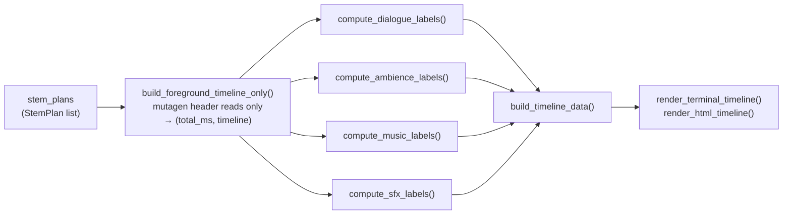
```mermaid
flowchart LR
    PLANS["`stem_plans
    (StemPlan list)`"]
    FT["`build_foreground_timeline_only()
    mutagen header reads only
    → (total_ms, timeline)`"]
    PLANS --> FT

    FT --> DLG2["`compute_dialogue_labels()`"]
    FT --> AMB2["`compute_ambience_labels()`"]
    FT --> MUS2["`compute_music_labels()`"]
    FT --> SFX2["`compute_sfx_labels()`"]

    DLG2 --> BTD["`build_timeline_data()`"]
    AMB2 --> BTD
    MUS2 --> BTD
    SFX2 --> BTD

    BTD --> RENDER["`render_terminal_timeline()
    render_html_timeline()`"]
```

> **Fast dry-run:** `build_foreground_timeline_only()` uses `mutagen.mp3.MP3(path).info.length`
> for header-only duration reads — orders of magnitude faster than `AudioSegment.from_file()`
> for a full episode.  The `compute_*_labels()` helpers apply the same boundary logic as the
> audio-loading layer builders (`build_ambience_layer` etc.) but return label tuples only.

---

## 11. Ambience Stop Markers

Script-side directives that end an ambience loop without starting a new one.

### Recognized patterns
- `[AMBIENCE: STOP]` — explicit stop
- `[AMBIENCE: DINER FADES OUT]`, `[AMBIENCE: B&B FADES OUT]` — any `FADES OUT` suffix

### How they work
1. **XILP001** auto-generates `type: "silence", duration_seconds: 0.0` entries in the sfx config — no audio asset is created
2. **mix_common `collect_stem_plans()`** injects a synthetic `StemPlan(filepath="")` for each stop marker found in the entries index — they never have a stem file on disk
3. **`build_ambience_layer()`** uses stop markers as `bg_cues` boundary markers: the preceding ambience loop's `end_ms` is set to the stop marker's timeline position
4. Stop marker plans are skipped when loading audio (empty filepath) and generate no label in the timeline

### `loop: false` vs stop markers
| | `loop: false` | Stop marker |
|---|---|---|
| Controlled in | sfx config | script |
| Effect | Plays file once (no tiling) | Ends loop at cue position |
| Audio generated | Yes | No |
| Timeline label | Yes | No |

## 12. XILP007 — Stem Migrator (Punch-In Workflow)

Migrates existing stems when a parsed script is revised. Compares old and
new parsed JSONs, copies unchanged stems to their new seq-numbered filenames,
and produces a report of what still needs TTS/SFX generation.  Run XILP002
afterwards — it skips stems already on disk, so only the gaps get API calls.

### When to use

- Script text corrections after a full TTS run
- Character renames / speaker reassignments
- Lines deleted or added (seq numbers shift for the remaining entries)
- Episode trimming (cutting scenes to meet runtime)

### Workflow

```
# 1. Edit & re-parse the revised script
xil parse "scripts/<revised>.md" --episode S02E03

# 2. Preview the migration plan (no file changes)
xil migrate --episode S02E03 --dry-run

# 3. Copy unchanged stems into new seq-numbered filenames
xil migrate --episode S02E03

# 4. Generate only the missing/changed/new stems
xil produce --episode S02E03 --dry-run
xil produce --episode S02E03
```

### Matching modes

| Mode | Flag | Em-dash / ellipsis variants | Use when |
|---|---|---|---|
| Fuzzy (default) | *(omit)* | Treated as identical | Punctuation-only edits |
| Strict | `--strict` | Must match exactly | Verify every character |

### Status codes

| Code | Meaning | Action needed |
|---|---|---|
| `COPY` | Text + speaker unchanged | File copied to new seq name; no TTS |
| `SPEAKER` | Same text, different speaker | Regen — different voice |
| `NEW` | No matching old entry | Generate fresh |
| `MISSING` | Match found, old file absent | Generate fresh |
| `SKIP` | Section/scene header — no stem | None |

### Two-phase match algorithm

1. **Exact**: `(normalized_text, speaker)` — safe COPY or MISSING
2. **Text-only fallback** (dialogue only): text matches but speaker differs → `SPEAKER`

The two-phase approach lets the tool distinguish "punctuation edit on same speaker"
(COPY in fuzzy mode) from "line reassigned to a different character" (SPEAKER).

## 13. XILU003 — CSV Annotation Utility

Read-only utility that joins a parsed episode CSV with the SFX JSON and cast JSON, producing a
single annotated review spreadsheet.  Useful for verifying that all direction entries have SFX
config entries, all speakers are assigned voices, and reviewing the full episode structure before
committing to a TTS run.

```bash
xil csv-join --episode S02E03
xil csv-join --episode S02E03 --output review/S02E03_annotated.csv
```

### Inputs / outputs

| File | Default path | Override flag |
|---|---|---|
| Input CSV | `parsed/parsed_<slug>_{TAG}.csv` | `--csv` |
| SFX config | `sfx_<slug>_{TAG}.json` | `--sfx` |
| Cast config | `cast_<slug>_{TAG}.json` | `--cast` |
| Output CSV | `parsed/annotated_<slug>_{TAG}.csv` | `--output` |

### Output columns appended

The output CSV keeps all original parsed columns (`seq`, `type`, `section`, `scene`, `speaker`,
`direction`, `text`, `direction_type`) and appends:

| Column | Source | Notes |
|---|---|---|
| `sfx_prompt` | SFX config `prompt` | Empty for dialogue |
| `sfx_duration` | SFX config `duration_seconds` | Empty for dialogue / silence |
| `sfx_type` | SFX config `type` | `sfx` / `silence` / `source` |
| `cast_full_name` | Cast config `full_name` | Empty for non-dialogue |
| `cast_voice_id` | Cast config `voice_id` | `TBD` if not yet assigned |
| `cast_role` | Cast config `role` | Empty if unset |

No API key required — read-only join, no audio generated.

## 14. XILP008 — Stale Stem Cleanup

Removes stale stems left behind after a parsed script revision and stem migration.
After XILP007 copies unchanged stems to new seq-numbered filenames, old stems whose
seq numbers now map to a different entry type remain on disk and cause warnings in
XILP005.  This script finds and deletes them.

### When to use

- After running XILP007 (stem migrator) and before XILP002 (voice generation)
- When XILP005 reports `[W] Stale stem skipped` warnings

### Stale detection rules

| Condition | Reason |
|---|---|
| Parsed entry is a header (`section_header` / `scene_header`) | Header entries never have stems — any stem at that seq is stale |
| Filename ends with `_sfx` but parsed entry at that seq is `dialogue` | Type mismatch — old SFX stem, now a spoken line |
| Filename ends with a speaker name but parsed entry is `direction` | Type mismatch — old dialogue stem, now a stage direction |
| Dialogue stem whose speaker suffix doesn't match the parsed speaker | Speaker mismatch — line reassigned to a different character |
| Multiple stems share the same seq number | Duplicate — only the one matching the expected basename survives |
| Seq number not present in the parsed JSON at all | Orphaned stem — entry was deleted or seq range changed |

### Flow

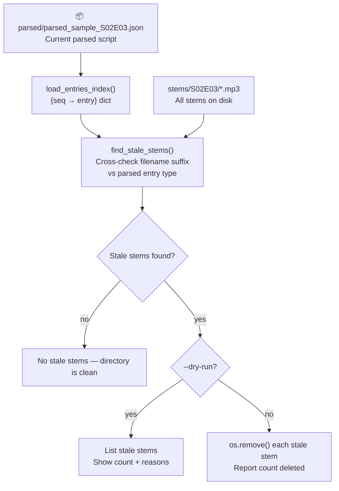
```mermaid
flowchart TD
    PARSED["`📦 parsed/parsed_sample_S02E03.json
    Current parsed script`"]
    STEMS["`stems/S02E03/*.mp3
    All stems on disk`"]

    LOAD["`load_entries_index()
    {seq → entry} dict`"]
    SCAN["`find_stale_stems()
    Cross-check filename suffix
    vs parsed entry type`"]

    PARSED --> LOAD --> SCAN
    STEMS --> SCAN

    SCAN --> RESULT{"Stale stems found?"}
    RESULT -->|no| CLEAN["No stale stems — directory is clean"]
    RESULT -->|yes| MODE{"--dry-run?"}
    MODE -->|yes| LIST["`List stale stems
    Show count + reasons`"]
    MODE -->|no| DELETE["`os.remove() each stale stem
    Report count deleted`"]
```

> **Relationship to XILP005 warnings:** Both XILP008 and `collect_stem_plans()` in
> `mix_common.py` detect stale stems via type mismatch, speaker mismatch, and seq
> deduplication.  Running XILP008 after migration eliminates the `[W] Stale stem skipped`
> warnings from XILP005.  XILP008 additionally catches stems whose seq is not present
> in the parsed JSON at all (orphaned stems), which XILP005 does not warn about.

## 15. XILU008 — Stem Log Report

Parses daily pipeline log files to reconstruct a chronological stem generation history.
Useful for auditing what was generated, when, with which backend, and confirming SHA256 checksums.

```bash
xil-stem-log --episode S03E03
xil-stem-log --episode S03E03 --since 2026-04-01 --output stem_log.csv
xil-stem-log --slug the413
xil-stem-log --logs-dir /path/to/logs
```

### Flow

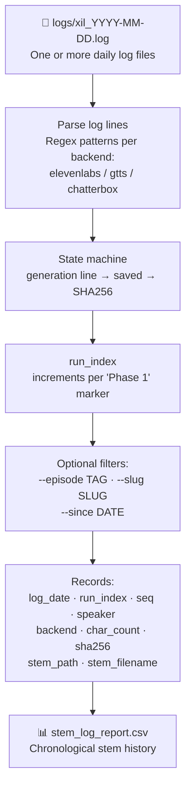
```mermaid
flowchart TD
    LOGS["`📂 logs/xil_YYYY-MM-DD.log
    One or more daily log files`"]
    PARSE["`Parse log lines
    Regex patterns per backend:
    elevenlabs / gtts / chatterbox`"]
    STATE["`State machine
    generation line → saved → SHA256`"]
    RUNIDX["`run_index
    increments per 'Phase 1' marker`"]
    FILTER["`Optional filters:
    --episode TAG · --slug SLUG
    --since DATE`"]
    RECORDS["`Records:
    log_date · run_index · seq · speaker
    backend · char_count · sha256
    stem_path · stem_filename`"]
    CSV["`📊 stem_log_report.csv
    Chronological stem history`"]

    LOGS --> PARSE --> STATE --> RUNIDX --> FILTER --> RECORDS --> CSV
```

> **`--episode TAG`** filters records to a specific episode tag (e.g. `S03E03`).
> **`--slug SLUG`** filters records to a specific show slug (e.g. `the413`).
> **`--since DATE`** filters to logs on or after the given date (YYYY-MM-DD format).
> **No API key required** — reads local log files only.

---

## 16. XILU009 — Workspace Migration

Moves pre-0.1.8 workspace files to the normalized layout introduced in 0.1.8. Idempotent —
re-running skips files already at their target path. Run once per existing workspace after
upgrading; new workspaces created by `xil-init` use the normalized layout automatically.

```bash
xil migrate-workspace --dry-run    # preview what would move
xil migrate-workspace              # execute moves
xil migrate-workspace --workspace /path/to/workspace
```

### Layout change summary

| Asset | Pre-0.1.8 (legacy) | 0.1.8+ (normalized) |
|-------|-------------------|----------------------|
| Cast config | `cast_{slug}_{tag}.json` (root) | `configs/{slug}/cast_{tag}.json` |
| SFX config | `sfx_{slug}_{tag}.json` (root) | `configs/{slug}/sfx_{tag}.json` |
| Parsed JSON | `parsed/parsed_{slug}_{tag}.json` | `parsed/{slug}/parsed_{tag}.json` |
| DAW layers | `daw/{tag}/` | `daw/{slug}/{tag}/` |
| Masters | `masters/{slug}_{tag}_master.mp3` | `masters/{slug}/{tag}_master.mp3` |
| Cues | `cues/cues_{slug}_{tag}.md` | `cues/{slug}/cues_{tag}.md` |
| Cues manifest | `cues/cues_manifest_{tag}.json` | `cues/{slug}/cues_manifest_{tag}.json` |
| Stems | `stems/{slug}/{tag}/` | unchanged |

### Flow

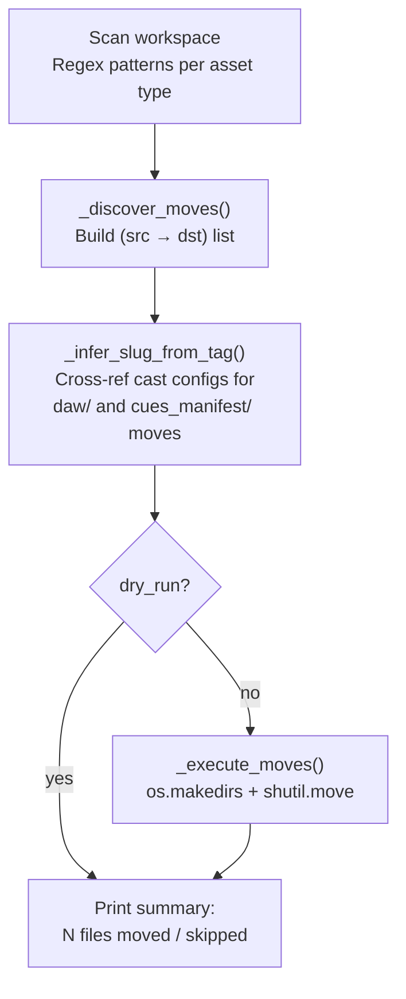
```mermaid
flowchart TD
    SCAN["`Scan workspace
    Regex patterns per asset type`"]
    DISCO["`_discover_moves()
    Build (src → dst) list`"]
    INFER["`_infer_slug_from_tag()
    Cross-ref cast configs for
    daw/ and cues_manifest/ moves`"]
    DRY{dry_run?}
    EXEC["`_execute_moves()
    os.makedirs + shutil.move`"]
    REPORT["`Print summary:
    N files moved / skipped`"]

    SCAN --> DISCO --> INFER --> DRY
    DRY -- yes --> REPORT
    DRY -- no --> EXEC --> REPORT
```

> **Backward compatibility**: `derive_paths()` automatically detects the legacy layout (root cast
> config present) and returns legacy paths, so existing workspaces continue to work without
> migration. Run `xil migrate-workspace` when ready to adopt the new layout.
> **No API key required** — local filesystem operations only.

---

## 17. XILP009 — Reverse Script Generator

Reconstructs a readable markdown production script from a parsed JSON, using cast config
for speaker display names.  Serves as a verification tool and produces a clean "revised"
version reflecting any post-parse edits.

```bash
xil regen --episode S02E03
xil regen --episode S02E03 --output scripts/revised_S02E03.md

# With SFX config — source-backed direction entries gain a pipe-hint filename suffix
xil regen --episode S02E03 --sfx configs/sample/sfx_S02E03.json
```

### Parameters

| Parameter | Default | Description |
|-----------|---------|-------------|
| `--episode TAG` | — | Episode tag (e.g. `S02E03`). Mutually exclusive with `--tag`. |
| `--tag TAG` | — | Raw non-episodic tag (e.g. `V01C03`). Mutually exclusive with `--episode`. |
| `--parsed PATH` | `parsed/<slug>/parsed_<slug>_<TAG>.json` | Override parsed JSON input path. |
| `--cast PATH` | `configs/<slug>/cast_<TAG>.json` | Override cast config path. |
| `--sfx PATH` | `configs/<slug>/sfx_<TAG>.json` | Override SFX config path. When the file exists, direction entries are emitted with a pipe-hint filename suffix (`[SFX: TEXT \| filename.mp3]`) for any entry whose SFX config key has a `source` field. Prompt-only and silence entries are unaffected. |
| `--output PATH` | `scripts/revised_<slug>_<TAG>.md` | Override output markdown path. |
| `--show NAME` | from `project.json` | Show name override for slug derivation. |
| `--speakers PATH` | auto-detect → built-in | Path to `speakers.json` for speaker key → display name mapping. |

### Pipe-hint behaviour

When `--sfx` is supplied (or `sfx_<TAG>.json` exists at the default path), direction
entries that resolve to a `source`-backed asset are emitted in pipe-hint format:

```
[SFX: PAPER LETTER FOLDED, SET DOWN ON TABLE | PAPRImpt-A_realistic_sound_of-Elevenlabs.mp3]
[AMBIENCE: RADIO BOOTH - SOFT EQUIPMENT HUM, SLIGHT STATIC, INTIMATE | ambience_radio-booth-soft-equipment-hum-slight-static-intimate.mp3]
```

Entries with only a `prompt` key (API-generated) or `"type": "silence"` emit without a hint:

```
[MUSIC: STING OUT]
[BEAT]
[VINTAGE FILTER ENGAGES]
```

This makes the regenerated script immediately usable as a new episode template — the
pipe-hints allow `xil` to resolve assets from the library without re-generating them.

### Flow

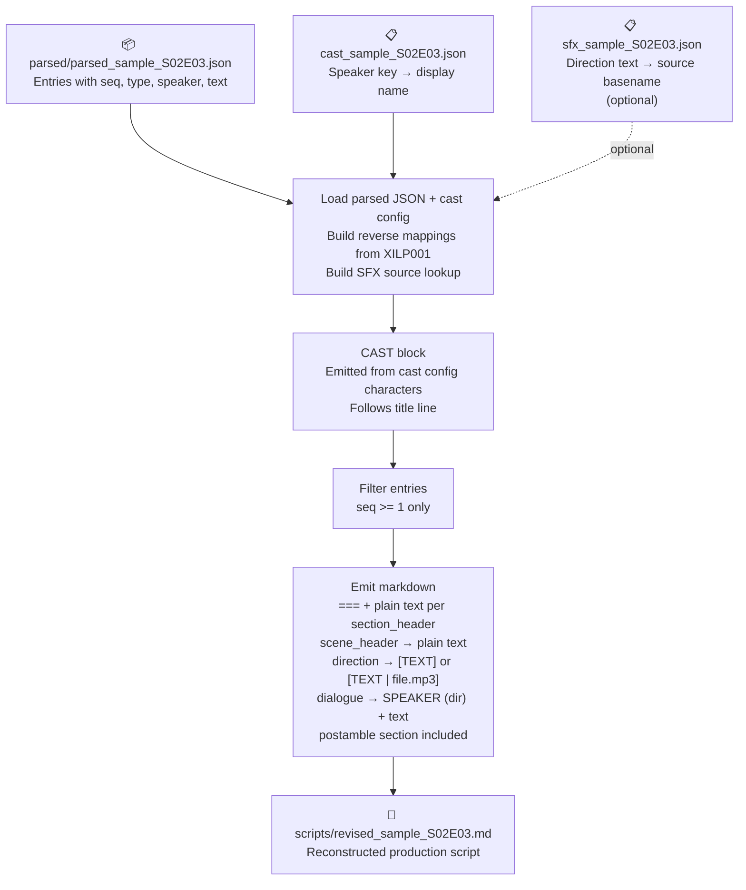
```mermaid
flowchart TD
    PARSED["`📦 parsed/parsed_sample_S02E03.json
    Entries with seq, type, speaker, text`"]
    CAST["`📋 cast_sample_S02E03.json
    Speaker key → display name`"]
    SFX["`📋 sfx_sample_S02E03.json
    Direction text → source basename
    (optional)`"]

    LOAD["`Load parsed JSON + cast config
    Build reverse mappings from XILP001
    Build SFX source lookup`"]
    CAST_BLOCK["`CAST block
    Emitted from cast config characters
    Follows title line`"]
    FILTER["`Filter entries
    seq >= 1 only`"]
    EMIT["`Emit markdown
    === + plain text per section_header
    scene_header → plain text
    direction → [TEXT] or [TEXT | file.mp3]
    dialogue → SPEAKER (dir) + text
    postamble section included`"]

    PARSED --> LOAD
    CAST --> LOAD
    SFX -.->|optional| LOAD
    LOAD --> CAST_BLOCK --> FILTER --> EMIT
    EMIT --> OUTPUT["`📄 scripts/revised_sample_S02E03.md
    Reconstructed production script`"]
```

> **Round-trip verification:** Parse the regenerated script with XILP001 and compare
> entry counts against the original parsed JSON. Dialogue and direction counts should
> match exactly, including PREAMBLE and POSTAMBLE sections.
>
> **No API key required** — read-only transformation, no audio generated.

## 18. XILP010 — Studio Export Importer

Extracts dialogue stems from an ElevenLabs Studio export ZIP and renames them to the pipeline's stem naming convention (`{seq:03d}_{section}[-{scene}]_{speaker}.mp3`).

This provides an alternative to XILP002 voice generation: instead of calling the ElevenLabs TTS API per-line, an entire episode can be generated via ElevenLabs Studio (onboarded by XILP004), exported as a ZIP, and imported back into the pipeline with correct filenames.

```bash
xil import --episode S02E02 \
    --zip "ElevenLabs_exports/ElevenLabs_Working_with_Gen_S02E02_What_We_Carry_!.zip" --dry-run
xil import --episode S02E02 \
    --zip "ElevenLabs_exports/ElevenLabs_Working_with_Gen_S02E02_What_We_Carry_!.zip"
```

### Data flow

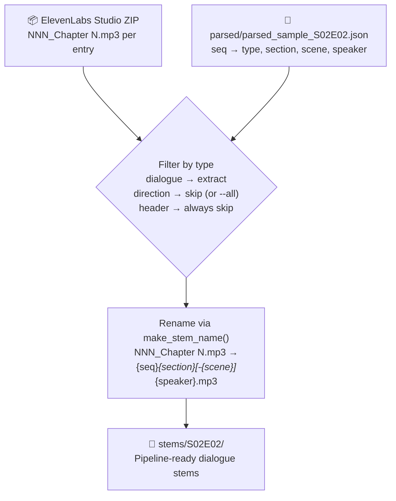
```mermaid
flowchart TD
    ZIP["`📦 ElevenLabs Studio ZIP
    NNN_Chapter N.mp3 per entry`"]
    PARSED["`📄 parsed/parsed_sample_S02E02.json
    seq → type, section, scene, speaker`"]
    FILTER{"`Filter by type
    dialogue → extract
    direction → skip (or --all)
    header → always skip`"}
    RENAME["`Rename via make_stem_name()
    NNN_Chapter N.mp3 →
    {seq}_{section}[-{scene}]_{speaker}.mp3`"]
    STEMS["`📂 stems/S02E02/
    Pipeline-ready dialogue stems`"]

    ZIP --> FILTER
    PARSED --> FILTER
    FILTER --> RENAME --> STEMS
```

> **No API key required** — extraction only, no API calls made.
> After import, run XILU002 for SFX stems and XILP002 for voice stems (preamble/postamble sections included).

## 19. XILP011 — Final Master MP3 Export

Overlays the DAW layer WAV files produced by XILP005 into a single stereo MP3 file suitable for podcast distribution.

```bash
xil master --episode S02E03 --dry-run
xil master --episode S02E03
xil master --episode S02E03 --show "Night Owls"
```

### Data flow

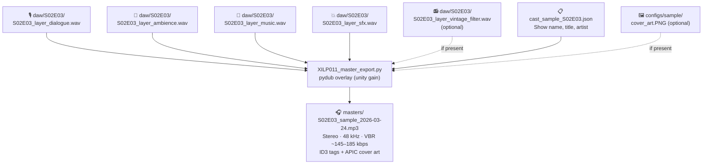
```mermaid
flowchart TD
    DIALOGUE["`🎙️ daw/S02E03/
    S02E03_layer_dialogue.wav`"]
    AMBIENCE["`🌿 daw/S02E03/
    S02E03_layer_ambience.wav`"]
    MUSIC["`🎵 daw/S02E03/
    S02E03_layer_music.wav`"]
    SFX["`💥 daw/S02E03/
    S02E03_layer_sfx.wav`"]
    VF["`📻 daw/S02E03/
    S02E03_layer_vintage_filter.wav
    (optional)`"]
    MIX["XILP011_master_export.py
    pydub overlay (unity gain)"]
    CAST["`📋 cast_sample_S02E03.json
    Show name, title, artist`"]
    ART["`🖼️ configs/sample/
    cover_art.PNG (optional)`"]
    MASTER["`🎧 masters/
    S02E03_sample_2026-03-24.mp3
    Stereo · 48 kHz · VBR ~145–185 kbps
    ID3 tags + APIC cover art`"]

    DIALOGUE --> MIX
    AMBIENCE --> MIX
    MUSIC --> MIX
    SFX --> MIX
    VF -.->|if present| MIX
    CAST --> MIX
    ART -.->|if present| MIX
    MIX --> MASTER
```

> **No API key required** — local audio processing only.
> Mix balance is handled by XILP005; XILP011 overlays all present layers at unity gain.
> Output filename includes the run date: `{TAG}_{slug}_{YYYY-MM-DD}.mp3`.
> **Cover art:** `_find_cover_art(slug)` checks `configs/<slug>/cover_art.PNG|png|jpg|jpeg`. When found, the image is embedded as an APIC front-cover frame via `tag_mp3(cover_art_path=...)` — no extra step required. Silently skipped when absent so shows without cover art are unaffected.


## 20. XILP012 — Social Media Post Draft Generator

Reads a parsed episode JSON, builds a structured episode summary (cold open excerpt, cast list, section arc, runtime), and calls the Claude API (Haiku) to produce three ready-to-edit post variants. Output is an editable markdown file the producer reviews and pastes.

```bash
xil publish --episode S04E01 --dry-run
xil publish --episode S04E01
xil publish --episode S04E01 --platform instagram
xil publish --all
```

**Post variants per episode:**

| Variant | Description |
|---------|-------------|
| **Hype** | New episode announcement, teaser tone, no spoilers past cold open. Mentions show name, episode title, and Berkshire Talking Chronicle. |
| **Quote** | Pulls a memorable line from the cold open dialogue. Formatted as a blockquote with a tune-in call to action. |
| **Spotlight** | Features one cast member. Cycles by `(episode_number − 1) % cast_count` so each episode highlights a different character. |

### Data flow

```mermaid
flowchart TD
    PARSED["`📄 parsed/the413/
    parsed_S04E01.json
    (show, title, entries, stats)`"]
    CAST["`📋 configs/the413/
    cast_S04E01.json
    (full_name, role)`"]
    MASTER["`🎧 masters/the413/
    S04E01_master.mp3
    (runtime, optional)`"]
    EXTRACT["extract_episode_summary()
    cold open · cast · section arc"]
    PROMPT["build_user_message()
    structured episode brief"]
    CLAUDE["Claude API
    claude-haiku-4-5-20251001
    system prompt cached"]
    POSTS["`📝 posts/the413/
    S04E01_posts.md
    3 variants: Hype · Quote · Spotlight`"]

    PARSED --> EXTRACT
    CAST --> EXTRACT
    MASTER -.->|optional runtime| EXTRACT
    EXTRACT --> PROMPT
    PROMPT --> CLAUDE
    CLAUDE --> POSTS
```

### CLI flags

| Flag | Default | Description |
|------|---------|-------------|
| `--episode` / `--tag` | — | Episode tag (required unless `--all`) |
| `--show` | `project.json` | Show name override |
| `--platform` | `facebook` | `facebook` or `instagram` — affects prompt style |
| `--dry-run` | off | Print prompt + token estimate; no API call, no file written |
| `--all` | off | Batch-generate for every parsed episode under the current slug |
| `--model` | `claude-haiku-4-5-20251001` | Override Claude model ID |

> **`ANTHROPIC_API_KEY` required** for non-dry-run mode.
> Install the optional dependency first: `pip install 'xil-pipeline[publish]'`
> Prompt caching (`cache_control: ephemeral`) on the static system prompt reduces cost on `--all` batch runs.
> Output path: `posts/{slug}/{tag}_posts.md`


## 21. XILU014 — Episode Summary CSV

Scans all `parsed_<tag>.json` files under the workspace `parsed/` directory and writes a one-row-per-episode summary CSV. Useful for tracking episode word counts, dialogue line counts, and TTS character spend across a season.

```bash
xil episode-summary                          # writes episode_summary.csv in workspace root
xil episode-summary --output summary.csv     # custom output path
xil episode-summary --show "THE 413"         # filter to one show
xil episode-summary --stdout                 # write CSV to stdout (no banner)
```

### Output columns

| Column | Source | Notes |
|--------|--------|-------|
| `show` | parsed JSON `show` | Show name (e.g. `THE 413`) |
| `tag` | filename | Episode tag (e.g. `S03E02`) |
| `season` | parsed JSON `season` | Integer season number |
| `episode` | parsed JSON `episode` | Integer episode number |
| `title` | parsed JSON `title` | Episode title |
| `season_title` | parsed JSON `season_title` | Arc/season title |
| `dialogue_lines` | parsed JSON `stats.dialogue_lines` | Total voiced lines |
| `words` | counted from `entries` | Word count (dialogue entries only) |
| `tts_chars` | parsed JSON `stats.characters_for_tts` | TTS character budget |

### Data flow

```mermaid
flowchart TD
    PARSED["`📂 parsed/{slug}/
    parsed_<tag>.json (all episodes)`"]
    COLLECT["`_collect_files()
    Glob parsed_*.json recursively
    Skip roundtrip_ and pre_splice_ prefixes`"]
    BUILD["`build_summary()
    Extract show / tag / season / episode
    title / season_title / stats
    Count words from dialogue entries`"]
    SORT["`Sort by show → season → episode → tag`"]
    CSV["`📊 episode_summary.csv
    One row per episode`"]

    PARSED --> COLLECT --> BUILD --> SORT --> CSV
```

> **`--show` filter** is case-insensitive. Use `--show "THE 413"` to limit output to one show when the workspace contains multiple shows.
> **`--stdout`** suppresses the run banner — safe to pipe to other tools.
> **No API key required** — reads local JSON files only.

---

## 22. XILU015 — Stem Verifier

Scans a stems folder and produces a JSON report with file attributes and optional Faster-Whisper transcriptions. Useful for verifying that generated MP3s contain the expected dialogue and for auditing file integrity after a production run.

```bash
xil-stem-verify --episode S01E01 --no-transcribe          # attributes only (fast)
xil-stem-verify --show the413 --episode S01E01             # attributes + transcription
xil-stem-verify --show the413 --episode S01E01 --model small --language en
xil-stem-verify --stems-dir /custom/path --output /tmp/report.json --no-transcribe
```

### CLI flags

| Flag | Default | Description |
|------|---------|-------------|
| `--show` / `-s` | from `project.json` | Show slug override |
| `--episode` / `-e` | — | Episode tag (required) |
| `--stems-dir DIR` | `<workspace>/stems/<slug>/<episode>/` | Override stems directory |
| `--output` / `-o` | `<workspace>/parsed/<slug>/stem_verify_<episode>.json` | Output JSON path |
| `--whisper-python PATH` | auto-detected | Path to `venv-whisper/bin/python3` |
| `--model SIZE` | `large-v3-turbo` | Whisper model: tiny/base/small/medium/large-v3/large-v3-turbo |
| `--language LANG` | `en` | Language hint; use `auto` for detection |
| `--beam-size N` | `5` | Whisper beam size |
| `--device` | `cuda` | `cuda` or `cpu`; auto-falls back to CPU if CUDA libraries missing |
| `--no-transcribe` | off | Skip Whisper; output file attributes only |

### Output JSON structure

```json
{
  "show": "the413",
  "episode": "S01E01",
  "generated": "2026-06-06T13:31:41",
  "stems_dir": "/abs/path/stems/the413/S01E01",
  "whisper_model": "large-v3-turbo",
  "file_count": 166,
  "total_duration_seconds": 743.23,
  "files": [
    {
      "filename": "003_cold-open_adam.mp3",
      "path": "/abs/path/003_cold-open_adam.mp3",
      "seq": 3,
      "scene": "cold-open",
      "speaker": "adam",
      "size_bytes": 164978,
      "duration_seconds": 10.188,
      "bitrate_kbps": 128,
      "sha256": "a5f3a27a…",
      "transcript": {
        "text": "full transcribed text",
        "language": "en",
        "language_probability": 0.9999,
        "segments": [{"start": 0.0, "end": 2.5, "text": "…"}]
      }
    }
  ]
}
```

`transcript` is `null` for all entries when `--no-transcribe` is used. SFX stems naturally produce empty or near-empty transcripts.

### Data flow

```mermaid
flowchart TD
    STEMS["`📂 stems/<slug>/<episode>/
    *.mp3 files`"]
    MUTAGEN["`mutagen.mp3.MP3()
    duration_seconds · bitrate_kbps`"]
    HASH["`hash_file() from XILU007
    SHA-256 digest`"]
    PARSE["`_parse_stem_filename()
    seq · scene · speaker from filename`"]
    WHISPER{"`--no-transcribe?`"}
    WORKER["`_WhisperClient
    venv-whisper subprocess
    whisper_worker.py JSON protocol`"]
    NOOP["`transcript: null`"]
    JSON["`📊 parsed/<slug>/
    stem_verify_<episode>.json`"]

    STEMS --> MUTAGEN
    STEMS --> HASH
    STEMS --> PARSE
    STEMS --> WHISPER
    WHISPER -->|no| WORKER
    WHISPER -->|yes| NOOP
    MUTAGEN --> JSON
    HASH --> JSON
    PARSE --> JSON
    WORKER --> JSON
    NOOP --> JSON
```

> **venv-whisper setup:** Create once with `python3 -m venv venv-whisper && venv-whisper/bin/pip install faster-whisper`. Place at workspace root or repo root — auto-detected in that order.
> **CUDA fallback:** `whisper_worker.py` probes CUDA at startup (silent 1-second test transcription). If `libcublas` or other GPU libraries are missing (common in WSL2), it silently reinitializes on `cpu/int8` before reporting ready.
> **No ElevenLabs API key required** — reads local files only.

---

## 23. XILU016 — Stem Compare

Cross-references a `stem_verify` Whisper transcript report against the parsed script to flag dialogue stems where TTS produced audio that differs significantly from the scripted line. Uses `difflib.SequenceMatcher` (stdlib) — no extra dependencies beyond the main venv.

```bash
xil-stem-compare --episode S01E01                                        # auto-derives both JSON paths
xil-stem-compare --episode S01E01 --threshold 0.70                       # stricter threshold
xil-stem-compare --episode S01E01 --output compare_S01E01.json           # also write JSON report
xil-stem-compare --stem-verify report.json --parsed parsed_S01E01.json   # explicit paths
xil-stem-compare --episode S01E01 --csv                                  # CSV output to stdout
```

### CLI flags

| Flag | Default | Description |
|------|---------|-------------|
| `--show` / `-s` | from `project.json` | Show slug override |
| `--episode` / `-e` | — | Episode tag; derives both JSON paths |
| `--stem-verify FILE` | `<workspace>/parsed/<slug>/stem_verify_<episode>.json` | Explicit stem_verify JSON path |
| `--parsed FILE` | `<workspace>/parsed/<slug>/parsed_<episode>.json` | Explicit parsed script JSON path |
| `--threshold FLOAT` | `0.75` | Similarity below this → `garbled` |
| `--output` / `-o` | none | Write full JSON report to file (terminal summary always shown) |
| `--csv` | off | Print flagged entries as CSV to stdout instead of banner summary |

### Status codes

| Code | Condition |
|------|-----------|
| `ok` | similarity ≥ threshold — not written to output |
| `garbled` | similarity < threshold and transcript is non-empty |
| `silent` | transcript.text is empty/whitespace — Whisper heard nothing |
| `no_stem` | dialogue entry exists in parsed but has no matching seq in stem_verify |
| `not_transcribed` | stem exists but transcript is null (verify ran with `--no-transcribe`) |

SFX stems (`speaker == "sfx"`) are always excluded. Direction-only entries (`direction_type` not null) are also excluded.

### JSON output (`--output`)

```json
{
  "show": "the413",
  "episode": "S01E01",
  "generated": "2026-06-06T16:00:00",
  "threshold": 0.75,
  "stem_verify_path": "/abs/path/stem_verify_S01E01.json",
  "parsed_path": "/abs/path/parsed_S01E01.json",
  "summary": {
    "total_dialogue": 127,
    "ok": 125,
    "garbled": 2,
    "silent": 0,
    "no_stem": 0,
    "not_transcribed": 0
  },
  "flags": [
    {
      "seq": 156,
      "section": "act-1",
      "scene": null,
      "speaker": "mr_patterson",
      "status": "garbled",
      "similarity": 0.71,
      "original": "That's because she had.",
      "transcript": "That's because Shihan."
    }
  ]
}
```

### Data flow

```mermaid
flowchart TD
    SV["`📊 stem_verify_<episode>.json
    Whisper transcripts per stem`"]
    PS["`📄 parsed_<episode>.json
    Scripted dialogue entries`"]
    JOIN["`join on seq
    dialogue entries only`"]
    NORM["`_normalize()
    lowercase + strip punctuation`"]
    SIM["`SequenceMatcher.ratio()
    character-level similarity`"]
    FLAGS["`flags list
    garbled · silent · no_stem · not_transcribed`"]
    OUT["`📊 compare_<episode>.json
    (--output, optional)`"]

    SV --> JOIN
    PS --> JOIN
    JOIN --> NORM
    NORM --> SIM
    SIM --> FLAGS
    FLAGS --> OUT
```

> **Workflow:** Run `xil-stem-verify` with Whisper transcription first, then `xil-stem-compare` to find garbled lines. Adjust `--threshold` to taste — 0.75 catches clear substitutions; 0.90 surfaces minor discrepancies like "forty" vs "40".
> **No ElevenLabs API key required** — reads local files only.

---

## 24. XILU017 — Remove Show

Removes all workspace files for a given show. Useful when retiring a show from the workspace or starting a production over from scratch.

```bash
xil remove-show mypodcast --dry-run
xil remove-show mypodcast --yes
xil remove-show "My Podcast" --dry-run
xil remove-show mypodcast --include-scripts --yes
```

### Artifacts removed

| Path | Notes |
|------|-------|
| `configs/{slug}/` | All cast + SFX configs |
| `parsed/{slug}/` | All parsed JSONs and CSVs |
| `stems/{slug}/` | All TTS/SFX stems |
| `daw/{slug}/` | All DAW layer WAVs |
| `masters/{slug}/` | All master MP3s |
| `cues/{slug}/` | Cues sheets + manifests |
| `posts/{slug}/` | Social media post drafts |
| `cast_{slug}_*.json`, `sfx_{slug}_*.json` (root) | Legacy layout configs |
| `parsed/parsed_{slug}_*.json` etc. (root) | Legacy flat parsed files |
| `.active_show` | Cleared if it points to the removed show |
| `scripts/*_{slug}_*.md` | Only with `--include-scripts` |

`SFX/` and `logs/` are **never** touched.

### CLI flags

| Flag | Description |
|------|-------------|
| `SHOW` (positional) | Show name or slug (`mypodcast` or `"My Podcast"`) |
| `--dry-run` / `-n` | Show what would be removed without deleting |
| `--yes` / `-y` | Skip the confirmation prompt |
| `--include-scripts` | Also remove matching `scripts/*.md` files (caution: source material) |

### Flow

```mermaid
flowchart TD
    INPUT["`SHOW
    name or slug`"]
    RESOLVE["`_resolve_slug()
    Accept name or slug
    Validate configs/{slug}/ exists`"]
    COLLECT["`_collect()
    Build removal list:
    dirs + files (normalized + legacy)`"]
    REPORT["`_report()
    Print [DIR] / [FILE] rows
    with file count + size`"]
    DRY{"--dry-run?"}
    CONFIRM{"--yes?"}
    PROMPT["`Type slug to confirm
    (or Ctrl-C to abort)`"]
    DELETE["`_delete()
    shutil.rmtree dirs
    Path.unlink files`"]
    DONE["`✓ N file(s) removed for show`"]

    INPUT --> RESOLVE --> COLLECT --> REPORT --> DRY
    DRY -->|yes| EXIT["Exit 0 (nothing deleted)"]
    DRY -->|no| CONFIRM
    CONFIRM -->|yes| DELETE
    CONFIRM -->|no| PROMPT --> DELETE
    DELETE --> DONE
```

> **Confirmation:** Without `--yes`, the command requires typing the slug exactly before anything is deleted. Ctrl-C or a wrong input aborts cleanly.
> **Scripts excluded by default:** Production scripts are source material — they are never removed unless `--include-scripts` is passed explicitly.
> **No API key required** — local filesystem operations only.

---

## 25. XILU018 — Remove Episode

Removes all workspace artifacts for a single episode while leaving the source production script and shared assets untouched.

```bash
xil remove-episode S01E01 --dry-run
xil remove-episode S01E01 --yes
xil remove-episode S01E01 --show "Night Owls" --dry-run
```

### Artifacts removed

| Path | Notes |
|------|-------|
| `configs/{slug}/cast_{tag}.json` | Cast config |
| `configs/{slug}/sfx_{tag}.json` | SFX config |
| `parsed/{slug}/parsed_{tag}.json` (+ `.csv`, `orig_`, `pre_splice_`, `stem_verify_`, `annotated`) | All parsed variants |
| `cues/{slug}/cues_{tag}.md` | Cues sheet |
| `cues/{slug}/cues_manifest_{tag}.json` | Cues manifest |
| `stems/{slug}/{tag}/` | All stems for this episode |
| `daw/{slug}/{tag}/` | All DAW layer WAVs |
| `masters/{slug}/{tag}_*.mp3` + `masters/{tag}_{slug}_{date}.mp3` | All master variants |
| `posts/{slug}/{tag}_posts.md` | Social media post drafts |
| `voice_samples/{tag}/` | Voice audition samples |
| Legacy root + parsed files | `cast_{slug}_{tag}.json`, `sfx_{slug}_{tag}.json`, flat parsed variants |

`SFX/`, `logs/`, and `scripts/` are **never** touched.

### CLI flags

| Flag | Default | Description |
|------|---------|-------------|
| `TAG` (positional) | — | Episode tag to remove (e.g. `S01E01`) |
| `--show` / `-s` | from `project.json` | Show name or slug override |
| `--dry-run` / `-n` | off | Show what would be removed without deleting |
| `--yes` / `-y` | off | Skip the confirmation prompt |

### Flow

```mermaid
flowchart TD
    INPUT["`TAG + optional SHOW`"]
    RESOLVE["`resolve_slug()
    Derive slug from project.json
    or --show override`"]
    COLLECT["`_collect()
    Enumerate normalized + legacy paths
    Deduplicate by path`"]
    REPORT["`_report()
    Print [DIR] / [FILE] rows
    with file count + size`"]
    DRY{"--dry-run?"}
    CONFIRM{"--yes?"}
    PROMPT["`Type TAG to confirm
    (or Ctrl-C to abort)`"]
    DELETE["`_delete()
    shutil.rmtree dirs
    Path.unlink files`"]
    DONE["`✓ N file(s) removed for episode`"]

    INPUT --> RESOLVE --> COLLECT --> REPORT --> DRY
    DRY -->|yes| EXIT["Exit 0 (nothing deleted)"]
    DRY -->|no| CONFIRM
    CONFIRM -->|yes| DELETE
    CONFIRM -->|no| PROMPT --> DELETE
    DELETE --> DONE
```

> **Script always preserved:** `scripts/` is excluded from removal — the source production script is never at risk.
> **Flat masters scoped to slug:** The `masters/{tag}_{slug}_{date}.mp3` glob is scoped by slug so two shows sharing the same tag (e.g. both having an `S01E01`) cannot accidentally delete the wrong master.
> **No API key required** — local filesystem operations only.

---

## 26. XILU019 — Episode Status

Make-style staleness checker for the episode pipeline. Walks the artifact chain from Google Drive source through to master MP3, reporting per stage whether outputs are up to date with their inputs, and prints the exact `xil` commands needed to refresh anything stale. Nothing is ever rebuilt.

```bash
xil status --episode S01E01
xil status S01E01 --show "Night Owls"
xil status --all
xil status --episode S01E01 --json
xil status --episode S01E01 --verbose
```

### Pipeline chain

```
Google Drive .gdoc → scripts/*.md → parsed/{slug}/parsed_{tag}.json
  → stems/{slug}/{tag}/*.mp3 → daw/{slug}/{tag}/*.wav → masters/{slug}/{tag}_*.mp3
```

### Stage status values

| Status | Meaning |
|--------|---------|
| `OK` | Stage has run at or after its newest input |
| `STALE` | Newest input is newer than newest output — stage has not re-run since input changed |
| `MISSING` | No output files exist yet |
| `-` | Informational (source stage only) — gdoc dir absent or no source doc found |

**STALE decision rule:** `max(inputs) > max(outputs)`. The newest output (not the oldest) is compared — older dedup-reused outputs from incremental builds do not trigger false staleness. What matters is whether the stage ran *after* its input last changed.

### CLI flags

| Flag | Default | Description |
|------|---------|-------------|
| `TAG` (positional) or `--episode` / `-e` | — | Episode tag to check (e.g. `S01E01`) |
| `--show` / `-s` | from `project.json` | Show name or slug override |
| `--all` / `-a` | off | Check all episodes for the show (one summary row per episode) |
| `--gdoc-dir` | `$XIL_GDOC_DIR` or `/mnt/i/My Drive` | Google Drive directory holding the source `.gdoc` |
| `--json` | off | Emit results as JSON (single-episode mode only) |
| `--verbose` / `-v` | off | List each output file with its mtime below the stage row |

### Flow (single-episode mode)

```mermaid
flowchart TD
    INPUT["`TAG + optional SHOW`"]
    SLUG["`resolve_slug()`"]
    GDOC["`_gdoc_files()
    Glob {tag}*.gdoc in gdoc_dir
    warn if dir not mounted`"]
    SCRIPT["`_script_files()
    scripts/*{tag}*.md
    excluding revised_*`"]
    PARSED["`parsed/{slug}/parsed_{tag}.json`"]
    STEMS["`stems/{slug}/{tag}/*.mp3
    + *_stem_manifest.json`"]
    DAW["`daw/{slug}/{tag}/*.wav`"]
    MASTERS["`_master_files()
    masters/{slug}/{tag}_*.mp3
    masters/{tag}_{slug}_{date}.mp3
    legacy root {slug}_{tag}_master.mp3`"]
    EVAL["`_evaluate_stage() × 6
    compute OK / STALE / MISSING
    per stage`"]
    PRINT["`_print_episode()
    STAGE · STATUS · NEWEST INPUT
    NEWEST OUTPUT · FILES`"]
    REJECTED["`_rejected_sfx()
    SFX effects graded 'rejected'
    in shared pool — warn if any`"]
    REFRESH["`Print xil commands
    for stale/missing stages`"]

    INPUT --> SLUG --> GDOC
    GDOC --> EVAL
    SCRIPT --> EVAL
    PARSED --> EVAL
    STEMS --> EVAL
    DAW --> EVAL
    MASTERS --> EVAL
    EVAL --> PRINT --> REJECTED --> REFRESH
```

### Flow (--all mode)

```mermaid
flowchart TD
    SLUG2["`resolve_slug()`"]
    DISCOVER["`_discover_tags()
    Glob parsed/ stems/ daw/ masters/
    for tags matching S\d+E\d+`"]
    LOOP["`For each tag:
    evaluate_episode()`"]
    WORST["`_worst()
    worst status across non-source stages`"]
    REJECTED2["`_rejected_sfx()
    count rejected SFX per episode`"]
    TABLE["`Print summary row:
    EPISODE · STATUS · NEXT STEP`"]

    SLUG2 --> DISCOVER --> LOOP --> WORST --> TABLE
    LOOP --> REJECTED2 --> TABLE
```

### JSON output (`--json`, single-episode only)

```json
{
  "show": "the413",
  "episode": "S01E01",
  "overall": "OK",
  "rejected_sfx": [],
  "stages": [
    {
      "name": "source",
      "status": "-",
      "newest_input": null,
      "newest_output": null,
      "oldest_output": null,
      "output_count": 0,
      "note": "no gdoc dir",
      "refresh": ""
    }
  ]
}
```

### Stems stage: manifest inclusion

The stems stage is judged against `*.mp3` files **plus** `*_stem_manifest.json`. The manifest is rewritten on every produce run — including no-op runs where all stems are dedup-reused — so it is the only file that advances when re-producing an unchanged episode. Without it, a stems stage made stale by a re-parse could never be cleared. The manifest is **not** included in the daw stage's inputs: a no-op manifest bump must not invalidate an up-to-date daw layer.

### Exit codes

| Code | Meaning |
|------|---------|
| `0` | All stages OK |
| `1` | Any stage is STALE or MISSING |
| `2` | Usage or resolution error |

> **Google Drive source:** The gdoc stage is informational — a missing or unmounted drive dir warns and continues rather than failing. Override the default mount with `--gdoc-dir` or the `XIL_GDOC_DIR` environment variable.
> **Rejected SFX:** Effects graded `rejected` in xil-gui are flagged in the status output — these are omitted from production until re-graded or replaced. Use `--json` to machine-read the `rejected_sfx` list.
> **No API key required** — reads local files and mtimes only.

---

## 27. Data Model Reference

All data classes used across the pipeline, grouped by layer. Pydantic `BaseModel` subclasses (all in `models.py`) carry validation and are serialized to/from JSON. `@dataclass` instances are in-memory runtime state only.

### 27a. Script parsing models — XILP001 output

```mermaid
classDiagram
    class ParsedScript {
        <<Pydantic>>
        +string show
        +int? season
        +int episode
        +string title
        +string? season_title
        +string source_file
        +List~ScriptEntry~ entries
        +ScriptStats stats
        +tag() string
    }
    class ScriptEntry {
        <<Pydantic>>
        +int seq
        +string type
        +string? section
        +string? scene
        +string? speaker
        +string? direction
        +string text
        +string? direction_type
        +string? sfx_source
    }
    class ScriptStats {
        <<Pydantic>>
        +int total_entries
        +int dialogue_lines
        +int direction_lines
        +int characters_for_tts
        +List~string~ speakers
        +List~string~ sections
    }
    ParsedScript "1" *-- "many" ScriptEntry : entries
    ParsedScript "1" *-- "1" ScriptStats : stats
```

`type` values: `dialogue` · `direction` · `section_header` · `scene_header`
`direction_type` values: `SFX` · `MUSIC` · `AMBIENCE` · `BEAT` · `VINTAGE FILTER`

---

### 27b. Cast configuration models

```mermaid
classDiagram
    class CastConfiguration {
        <<Pydantic>>
        +string show
        +int? season
        +int? episode
        +string? tag_override
        +string? title
        +string? season_title
        +string artist
        +Preamble? preamble
        +Preamble? postamble
        +Dict~string,CastMember~ cast
        +tag() string
    }
    class CastMember {
        <<Pydantic>>
        +string full_name
        +string voice_id
        +float pan
        +string|bool? filter
        +string role
        +float? stability
        +float? similarity_boost
        +float? style
        +bool? use_speaker_boost
        +string? language_code
        +float? speed
    }
    class Preamble {
        <<Pydantic>>
        +string? text
        +List~PreambleSegment~? segments
        +string speaker
        +float? speed
    }
    class PreambleSegment {
        <<Pydantic>>
        +string text
        +string? shared_key
    }
    class VoiceConfig {
        <<Pydantic>>
        +string id
        +float pan
        +string|bool? filter
    }
    CastConfiguration "1" *-- "many" CastMember : cast
    CastConfiguration "1" o-- "0..1" Preamble : preamble / postamble
    Preamble "1" o-- "many" PreambleSegment : segments
    CastMember ..> VoiceConfig : flattened into at load time
```

`filter` values: `false` (none) · `"phone"` · `"vintage"` · `"vintage,phone"`
`pan` range: −1.0 (full left) → 0.0 (centre) → 1.0 (full right)
`VoiceConfig` is the stripped-down view built by `load_production()` for use inside XILP002/XILP003.

---

### 27c. SFX configuration models

```mermaid
classDiagram
    class SfxConfiguration {
        <<Pydantic>>
        +string show
        +int? season
        +int? episode
        +string? tag_override
        +dict defaults
        +Dict~string,SfxEntry~ effects
        +List~string~ vintage_scenes
        +tag() string
    }
    class SfxEntry {
        <<Pydantic>>
        +string? prompt
        +string type
        +float duration_seconds
        +float? prompt_influence
        +bool loop
        +string? source
        +float? volume_percentage
        +float? ramp_in_seconds
        +float? ramp_out_seconds
        +float? play_duration
    }
    SfxConfiguration "1" *-- "many" SfxEntry : effects
```

`SfxEntry.type` values: `sfx` (API-generated) · `silence` (stop marker — no audio file)
`source` path bypasses API generation and reads the named file from `SFX/`.
`duration_seconds` is capped at 30 s for API-generated entries (ElevenLabs limit).

---

### 27d. Production runtime models

```mermaid
classDiagram
    class ProjectConfig {
        <<Pydantic>>
        +string show
        +string type
        +int? season
        +string? season_title
        +string? tag_format
    }
    class DialogueEntry {
        <<Pydantic>>
        +string speaker
        +string text
        +string stem_name
        +int seq
        +string? section
        +string? direction
    }
    class StemPlan {
        <<dataclass>>
        +int seq
        +string filepath
        +string? direction_type
        +string? entry_type
        +string? text
        +string? scene
        +bool foreground_override
        +float? volume_percentage
        +float? ramp_in_seconds
        +float? ramp_out_seconds
        +float? play_duration
        +string? tts_model
        +bool pre_trimmed
        +bool loop
    }
```

`ProjectConfig.type` values: `podcast` · `audiobook` · `drama` · `special`
`DialogueEntry` is produced by `load_production()` from `ScriptEntry` rows; `stem_name` is the output filename without extension.
`StemPlan` is built by `collect_stem_plans()` in `mix_common.py` from the stems directory and is consumed by XILP003 and XILP005.

---

### 27e. Pipeline utility models

```mermaid
classDiagram
    class MigrationAction {
        <<dataclass>>
        +string status
        +int new_seq
        +string new_stem
        +int? old_seq
        +string? old_stem
        +string reason
        +string entry_type
        +string? speaker
        +string new_text
        +string old_text
    }
    class StageStatus {
        <<dataclass>>
        +string name
        +string status
        +float? newest_input
        +float? newest_output
        +float? oldest_output
        +int output_count
        +string note
        +string refresh
        +bool inputs_present
        +List~Path~ output_files
    }
    class TimelineData {
        <<dataclass>>
        +string tag
        +float total_duration_s
        +Dict~string,List~ layers
    }
    class LayerSpan {
        <<dataclass>>
        +float start_s
        +float end_s
        +string label
        +float? ramp_in_s
        +float? ramp_out_s
        +float? play_duration
        +string? snippet
        +float? volume_pct
        +int? seq
        +string? tts_model
    }
    class CommandSpec {
        <<frozen dataclass>>
        +string module
        +string description
        +string group
        +string hint
    }
    class RemovalItem {
        <<union _Dir | _File>>
        +Path path
        +string label
        +file_count() int
        +total_bytes() int
    }
    class _Dir {
        <<dataclass>>
    }
    class _File {
        <<dataclass>>
    }
    TimelineData "1" *-- "many" LayerSpan : layers
    RemovalItem <|-- _Dir
    RemovalItem <|-- _File
```

`MigrationAction.status` values: `COPY` · `SPEAKER` · `NEW` · `MISSING` · `SKIP` (see §12)
`StageStatus.status` values: `OK` · `STALE` · `MISSING` · `-` (see §26)
`CommandSpec` is `frozen=True` — instances are immutable entries in the `XIL_SCRIPT_COMMANDS` registry in `xil.py`.
`RemovalItem` is the union type `_Dir | _File` used by XILU017 and XILU018; both share the same interface.

---

## Man Pages

All 37 CLI commands ship with Unix man pages, installed automatically when the package is pip-installed.

### Accessing man pages

After `pip install --user xil-pipeline`, pages land in `~/.local/share/man/man1/`. Add to `~/.bashrc`:

```bash
export MANPATH="$HOME/.local/share/man:$(manpath 2>/dev/null)"
```

Then use:

```bash
man xil-parse
man xil-produce
man xil           # dispatcher overview (lists all commands)
```

For system-wide installs (`sudo pip install`), pages land in `/usr/local/share/man/man1/` and are indexed by default.

### Regenerating man pages

Man pages are pre-generated from each command's `get_parser()` function and committed to `man/man1/`. Regenerate after any CLI flag changes:

```bash
pip install -e ".[dev]"      # includes argparse-manpage
python docs/build_man.py  # regenerate all 36 argparse-based pages
python docs/build_man.py --check  # exit 1 if any committed page is stale (runs in CI)
```

The `xil.1` dispatcher page (`man/man1/xil.1`) is hand-crafted and must be updated manually when the dispatcher's command list changes.

Drift protection: CI runs `--check` on Linux after the lint step (the comparison ignores the `.TH` date field), and `tests/test_man_pages.py` cross-checks `pyproject.toml [project.scripts]` against the `COMMANDS` registry in `docs/build_man.py` — a new CLI entry point without man-page registration fails the test suite.
